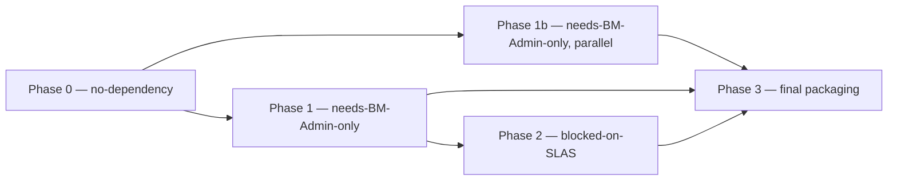

# Delivery & Shipping Plan — Back-In-Stock Waitlist Engine

Companion to `docs/HLD.md` (architecture) and `docs/UI-DESIGN.md` (component/state-machine
spec). This document does not repeat their content — it covers **packaging, sequencing,
and submission mechanics** for the four required deliverables.

**The verbatim assignment brief is embedded in Appendix B** — it is the source of truth for
scope. Note in particular the brief's Step 2 line: *"evaluate your software craftsmanship, API
design, **testing methodologies (e.g., Jest/Playwright)**, and attention to edge cases."*
Testing is an explicit evaluation axis, not an afterthought — see the testing rows in §2.1 and
the testing sequencing in Phase 0.

Grounding as of 2026-08-28:
- PWA Kit storefront: `~/Documents/adyen/waitlist-storefront/` — runs locally, points at the
  shared demo instance (`xfdy2axw` / `RefArch`), has a working `Notify Me` PDP override in
  `MOCK_MODE`.
- Cartridge scaffold: `~/Documents/adyen/back-in-stock-cartridge/` — `app_waitlist` cartridge
  (SCAPI endpoint, chunk job, webhook.site service, `WaitlistSubscription` custom object,
  SFRA controller), metadata XML, `SEED_DATA.md`. **Not deployed anywhere.**
- Both directories are currently **not** git repos (`git status` confirms no `.git` anywhere
  under `~/Documents/adyen`).
- **Duplication found:** `back-in-stock-cartridge/pwa/overrides/app/components/{notify-me,product-view}`
  is a **stale, earlier draft** of the same two files now live (and further along — MOCK_MODE,
  guard for SSR `process`, live-submit branch) at
  `waitlist-storefront/overrides/app/components/{notify-me,product-view}`. The storefront repo
  is the source of truth for the PWA overrides; the cartridge repo's copy must not be edited
  further or shipped as-is (see §1.3).
- SLAS gates only the headless-shopper live-POST path. It does not gate cartridge deploy,
  metadata export, unit tests, the SFRA controller path, or the merchant-facing demo.

**Environment facts confirmed 2026-08-29 (the Adyen-provisioned sandbox — from BM →
Administration → Site Development → Salesforce Commerce API Settings):**
- **Instance:** `zzft-025` (`Sandbox - ZZFT_025`, POD 8004, compatibility mode 22.7, UTC).
  BM URL: `https://zzft-025.dx.commercecloud.salesforce.com/on/demandware.store/Sites-Site/`.
- **Short Code:** `j1jska9w` (status Active).
- **Organization ID:** `f_ecom_zzft_025`.
- **Tenant ID:** `zzft_025` (format `{realm}_{instance}`).
- **Site:** one site exists — display name **"Waitlist Demo"**. Active code version `version1`
  with **0 cartridges deployed** (this is the deploy target for `app_waitlist`).
- The candidate has **BM Administrator** on this instance (enough to WebDAV-deploy, register the
  custom API, import metadata, create Services/Jobs, and run the job) — but **not** the SLAS
  admin role (see next).

**SLAS status confirmed 2026-08-29 — blocked on an Adyen role grant, not on the candidate:**
- Attempted self-provisioning via the SLAS Admin UI at
  `https://j1jska9w.api.commercecloud.salesforce.com/shopper/auth-admin/v1/ui/` → SSO succeeded
  but returned **"Unauthorized – no SLAS role found."**
- Root cause: the candidate's Account Manager user lacks the **SLAS Organization Administrator**
  role for tenant `zzft_025`. Only an Account Administrator (Adyen) can grant it.
- **Ask sent to recruitment (either unblocks):** (A, preferred) grant SLAS Organization
  Administrator on `zzft_025` so the candidate self-serves the client; or (B) Adyen provisions a
  **public** SLAS client and sends the Client ID with `http://localhost:3000/callback`
  registered. Option A is preferred because it also lets the candidate add/edit redirect URIs
  (including the MRT domain) without further round-trips.
- **This remains off the critical path.** The custom API, custom object, job, service, SFRA
  controller, metadata export, and all tests do **not** need SLAS. When the role/client lands it
  is a ~5-minute drop-in: create the public client → paste Client ID + the four instance values
  into `config/default.js` → set `WAITLIST_LIVE=true` → the PWA's already-deployed endpoint is
  called live. See §3 Phase 2.

**Corrected mental model (clarified 2026-08-29 — supersedes any looser phrasing below):**
- The custom SCAPI endpoint is **deployed to zzft-025 now, independent of SLAS** (WebDAV push +
  BM custom-API registration; gated by BM access, which the candidate has). It exists and is
  callable *with a token* the moment it's deployed.
- SLAS gates **only** whether a *browser* can obtain a shopper token to call it. It does not gate
  authoring, deploying, or registering the endpoint.
- The **shared demo instance (`xfdy2axw`) cannot host the endpoint at all** — it's Salesforce-run
  and not writable by the candidate. So on localhost-against-demo, `MOCK_MODE` calls *no* server
  (client-side simulated success); the real write path is proven on zzft-025 via the SFRA
  controller and the job, both SLAS-free.
- The **SFRA controller is a permanent parallel entry point**, not a temporary stand-in — it
  demonstrates the identical custom-object write with zero SLAS and stays in the deliverable even
  after the PWA live path works.

---

## 1. Repo / packaging strategy

### 1.1 One repo or two?

**One repo.** A grader evaluating "Source Code — zipped OR Git repo (preferred)" wants a
single clone that contains the cartridge, the storefront, and the docs together, with one
README at the root that ties them into one story. Two repos forces the grader to context-switch
and makes it easy to miss the cartridge (the harder half of the assignment) if they only open
the PWA link. Since **neither directory has git history to preserve**, there is no
submodule/subtree cost to merging them — this is a plain file move, not a history-preserving
merge.

### 1.2 Final monorepo layout

Promote `waitlist-storefront` to the repo root (it already has the right shape — `docs/`,
`overrides/`, `package.json` — and is the thing a grader will `npm start`). Move the cartridge
in as a sibling top-level folder, keep it as its own directory (not nested inside `app/`) so
its BM-deploy story stays self-contained.

```
back-in-stock-waitlist-engine/            # renamed root (was waitlist-storefront/)
├── README.md                             # NEW top-level README — the #4 deliverable (see §2.4)
├── .gitignore                            # NEW — see §1.4
├── package.json                          # PWA Kit (unchanged, from waitlist-storefront)
├── package-lock.json
├── babel.config.js / jest.config.js / .eslintrc.js / .prettierrc.yaml / .eslintignore
├── config/                               # PWA Kit config (shortCode/orgId/siteId/SLAS clientId)
├── overrides/                            # PWA Kit overrides — SOURCE OF TRUTH for Notify Me UI
│   └── app/components/{notify-me,product-view}/index.jsx
├── translations/
├── worker/
├── build/                                # gitignored — build output
├── docs/
│   ├── DELIVERY-PLAN.md                  # this file
│   ├── HLD.md                            # architecture (sibling doc, in progress)
│   ├── UI-DESIGN.md                      # UI/UX spec (already present)
│   └── assets/                           # NEW — screenshots/gifs referenced by README, if any
├── demo/                                 # NEW — the #3 deliverable
│   └── back-in-stock-demo.mp4            # (or a link if too large to commit — see §1.5)
└── cartridge/                            # MOVED from back-in-stock-cartridge/ (renamed dir)
    ├── app_waitlist/                     # the SFCC cartridge, unchanged
    │   ├── cartridge/{controllers,rest-apis,scripts}/...
    │   ├── package.json
    │   └── steptypes.json
    ├── metadata/back_in_stock/           # the #2 deliverable — XML export
    │   ├── meta/custom-objecttype-definitions.xml
    │   ├── services.xml
    │   ├── jobs.xml
    │   └── sites/<SITE-ID>/preferences.xml   # NEW — see §2.2
    ├── test/                             # NEW — Tier 1 unit tests (proxyquire+sinon+mocha)
    │   └── unit/...
    ├── SEED_DATA.md
    └── README.md                         # cartridge-specific detail; top-level README links here
```

Notes on what's deliberately **dropped**, not moved:
- `back-in-stock-cartridge/pwa/overrides/` — the stale duplicate PDP override. Do not move it.
  Its only remaining value is historical; if you want a record, note in a commit message that
  it was superseded, then delete it. Do not merge branches of logic from it into the storefront
  copy without diffing first (confirmed via `diff` that the storefront copy is strictly ahead).

### 1.3 `git init` + `.gitignore`

Run once, from the new root, after the directory move (see §3 Phase 0 for exact move commands):

```bash
cd ~/Documents/adyen/back-in-stock-waitlist-engine
git init
git add .
git commit -m "Initial commit: PWA Kit storefront + app_waitlist cartridge + docs"
```

`.gitignore` (root) — the PWA Kit side already generates a large `node_modules/` and `build/`;
the cartridge side has none of its own tooling but keep it defensive:

```gitignore
# PWA Kit / Node
node_modules/
build/
.env
.env.*
!.env.example
npm-debug.log*
*.log
.DS_Store

# PWA Kit local credentials (pwa-kit-dev save-credentials writes here)
.pwa-kit/
dw.json
.cursor/

# Cartridge
cartridge/**/node_modules/
*.zip

# Demo video if committed as a large binary — prefer Git LFS or an external link (see §1.5)
demo/*.mp4
```

If demo video is small enough to commit as a plain blob (<50 MB, most single-take screen
recordings compressed to H.264 will be), remove the `demo/*.mp4` ignore line and commit it
directly — simplest for a grader with no LFS setup. Only reach for Git LFS or an external
link (Drive/Loom) if the file is large; note the link in the README either way.

### 1.4 Zip fallback

If the assignment portal wants a zip instead of (or in addition to) a repo URL, zip the **git
working tree with the same excludes** rather than a raw folder copy, so the zip matches what's
in git:

```bash
cd ~/Documents/adyen/back-in-stock-waitlist-engine
git archive --format=zip -o ../back-in-stock-waitlist-engine.zip HEAD
```

`git archive` automatically excludes anything not committed (i.e., anything `.gitignore`d) —
no manual `node_modules` exclusion needed, and it guarantees the zip and the repo never drift.

### 1.5 Ship the demo-preset PWA as-is, or clean it?

**Ship as-is, don't clean.** `waitlist-storefront` is generated from
`@salesforce/retail-react-app` (`ccExtensibility.extends`), so it carries the full demo
storefront (home page, PLP, cart, checkout, account, `my-new-route` sample route, etc.) that
isn't related to the assignment. Reasons not to strip it:
- The assignment is graded on the **Notify Me feature working inside a real PWA Kit app**, not
  on a minimal repo. A stripped-down single-page app is *less* convincing evidence of platform
  fluency, not more.
- Removing retail-react-app boilerplate is itself a nontrivial, risky refactor (routing,
  shared UI providers, `_app-config`) for zero grading benefit, on a deadline.
- The unrelated `pages/my-new-route/index.jsx` scaffold route is worth deleting (2 minutes,
  zero risk) since it's dead example code with no purpose in a submission — but that's the
  extent of the cleanup.

Action: delete `overrides/app/pages/my-new-route/` before the final commit; leave everything
else from the preset untouched.

### 1.6 How the grader clones and runs it

Document this verbatim in the top-level README (Setup section), split shopper-side vs
merchant-side:

```bash
# 1. Clone / unzip
git clone <repo-url> back-in-stock-waitlist-engine
cd back-in-stock-waitlist-engine

# 2. PWA Kit storefront (shopper-facing)
npm install
cp .env.example .env   # fill in SLAS clientId if you have one; MOCK_MODE works without it
npm start              # -> https://localhost:3000

# 3. Cartridge (merchant-facing / backend) — requires a B2C Commerce sandbox + BM Administrator
cd cartridge
npm install            # if test tooling added (see §2.4/Tier 1)
npm test               # Tier 1 unit tests — no sandbox needed
# Deploy app_waitlist via WebDAV (see cartridge/README.md §"Deploy the cartridge")
# Import cartridge/metadata/back_in_stock/ via Site Import & Export
```

---

## 2. Deliverable-by-deliverable checklist

Status legend: `done` · `needs-sandbox` (needs BM Administrator access to zzft-025, no SLAS
required) · `needs-SLAS` (blocked on the SLAS client grant) · `not-started`.

### 2.1 Deliverable 1 — Source Code

| Task | Status | Command / step |
|---|---|---|
| Cartridge code (SCAPI endpoint, job, service, controller) | done | — already written in `app_waitlist/cartridge/` |
| PWA `Notify Me` override (MOCK_MODE) | done | — already working locally |
| PWA live-submit branch (real SLAS token) | done (code) / needs-SLAS (verify) | code exists in `notify-me/index.jsx`'s `submitLive`; can't exercise end-to-end without a SLAS client |
| Consolidate into one repo | not-started | §1.2 move + `git init` (§1.3) |
| Delete stale `pwa/overrides` duplicate | not-started | `rm -rf cartridge/pwa/` after confirming storefront copy is authoritative (already confirmed via diff) |
| Delete `my-new-route` sample page | not-started | `rm -rf overrides/app/pages/my-new-route` |
| **Cartridge unit tests** (proxyquire+sinon+mocha over `dw/*`) | not-started | new `cartridge/test/unit/` — cover `waitlistKey.js` (hash determinism), `script.js` `joinWaitlist` (validation + dedupe branch), `notifyWaitlist.js` (read/process/write status transitions), `waitlistNotifyService.js` (mock/parseResponse) |
| **PWA component tests (Jest + React Testing Library)** | not-started | the brief names **Jest** explicitly. PWA Kit ships `pwa-kit-dev test` (Jest under the hood — `npm test` already wired). New `overrides/app/components/notify-me/index.test.jsx` — cover the state machine: idle→sending→done (success), idle→sending→error (failure), already-subscribed response branch, empty/invalid email guard, and the Add-to-Cart↔Notify-Me swap in `product-view` under in-stock vs OOS props. Mock the submit (`MOCK_MODE` + a mocked `fetch` for `submitLive`). |
| **E2E test (Playwright)** — optional but named in the brief | not-started | the brief names **Playwright** explicitly. One happy-path spec against the local `npm start` server: load a PDP with `?forceOOS=1` → assert Notify-Me renders → fill email → submit → assert success state. Keep it to 1–2 specs — depth in Jest, breadth-proof in Playwright. If time-boxed out, document in the README why (and that the Jest suite carries the behavioural coverage). |
| Lint (Tier 3) | not-started | `npm run lint` (PWA side, already wired); add an `eslint` pass for cartridge JS if time allows |
| Final commit + push | not-started | `git add . && git commit -m "..." && git push` |

### 2.2 Deliverable 2 — Metadata (XML export)

The brief asks for: **data schema, job schedules, services, site preferences.** Enumerate all
four explicitly — the fourth (site preferences) doesn't exist yet in the scaffold.

| Artifact | File | Status | Note |
|---|---|---|---|
| Custom object type definition | `metadata/back_in_stock/meta/custom-objecttype-definitions.xml` | done | `WaitlistSubscription`; this is the one XML category the README already calls "the reliable import" |
| Job schedule | `metadata/back_in_stock/jobs.xml` | done (draft) | needs-sandbox to validate import; version-sensitive (see below) |
| Services (credential + profile + service) | `metadata/back_in_stock/services.xml` | done (draft) | same version-sensitivity caveat; webhook.site URL is currently modeled as the **service credential URL** (correct production pattern — never hardcode an endpoint URL in code) |
| Site preferences | **not-started** | new `metadata/back_in_stock/sites/<SITE-ID>/preferences.xml` | see below — add a custom preference group so "site preferences" is a real, separate deliverable artifact, not just folded into the service credential |

**Why add a site-preference artifact when the webhook URL is already a service credential?**
The credential URL is correct for the *service* itself, but the assignment brief names "site
preferences" as its own required XML category. Add a small custom site-preference group that a
merchant would actually want exposed outside of Services config, e.g.:

- `waitlistNotifyThreshold` (int, default 1) — mirrors the job's `NotifyThreshold` parameter,
  but as a merchant-editable site pref instead of a job parameter, so non-technical merchandising
  can tune it without touching job config.
- `waitlistEnabled` (boolean, default true) — a kill switch a merchant can flip without
  disabling the whole job.

Create this in BM once you have sandbox access (Merchant Tools → Site Preferences → Custom
Preferences → new attribute group `Waitlist`), then export it — do not hand-author this XML
speculatively; see the version-sensitivity mitigation below.

**Version-sensitive import risk — mitigation (create-in-BM-then-re-export):**
The cartridge's own README already flags this for `services.xml`/`jobs.xml`: the import XML
schema version (`xmlns=".../2014-09-26"` for services, `.../2015-07-01"` for jobs) must match
what the target instance's B2C Commerce version accepts, and hand-authored XML risks a "cannot
be recognized"/partial-import failure. The reliable procedure, in order:

1. **Import only the custom object type XML first** (`custom-objecttype-definitions.xml`) — this
   is the one already verified against the live schema and lowest-risk.
2. **Create the Service (credential + profile + service) and the Job by hand in Business
   Manager UI** using the values documented in `services.xml`'s and `jobs.xml`'s comments —
   don't attempt the XML import for these two if it fails once.
3. **Re-export** (Administration → Site Development → Site Import & Export → Export →
   select Services / Jobs / Site Preferences) to regenerate the XML **from the instance itself**.
   This produces authoritative XML guaranteed to round-trip on that instance's schema version,
   which is what actually ships as the metadata deliverable — not the hand-authored draft.
4. Replace the draft files in `cartridge/metadata/back_in_stock/` with the re-exported versions;
   keep a one-line README note ("regenerated via BM export on <date> against B2C Commerce
   version <X>") so the grader understands why the file differs from a hand-written import spec.

**Site-import archive structure** (what the actual zip you export/import looks like — confirm
against the Export UI's own zip once you have sandbox access, this is the standard shape):

```
site-import-archive.zip
├── meta/
│   └── custom-objecttype-definitions.xml     # organization-level, not site-scoped
├── services.xml                              # organization-level (Services are org-wide, not per-site)
├── jobs.xml                                  # can be global here, or under sites/<id>/jobs.xml if site-scoped
└── sites/
    └── <SITE-ID>/
        └── preferences.xml                   # site-scoped custom preferences (waitlistNotifyThreshold, waitlistEnabled)
```

### 2.3 Deliverable 3 — Demo Video

See §4 for the full shot-list. Checklist:

| Task | Status |
|---|---|
| Fallback script written (no SLAS) | done — this doc, §4 |
| Ideal script written (with SLAS) | done — this doc, §4 |
| Record shopper-facing segment | needs-sandbox (fallback: demo instance + MOCK_MODE is enough) |
| Record merchant-facing segment (BM custom object, job run, webhook.site) | needs-sandbox |
| Record live-SLAS segment (if it lands in time) | needs-SLAS |
| Edit to 3–5 min, export | not-started |

### 2.4 Deliverable 4 — Technical Documentation (README)

Map `back-in-stock-assignment.md` content into the required sections. This file was the
planning blueprint, written for the author, not the grader — trim accordingly.

| README section (required) | Source in `back-in-stock-assignment.md` | Trim guidance |
|---|---|---|
| **Architecture overview** | §3 (data-flow diagram) | Keep the diagram; keep it to architecture only — move the "why SCAPI not hooks/OCAPI" and "why chunk not task" justification prose into an "Architectural Decisions" subsection (below), don't let it bloat the top-of-README overview |
| **Setup instructions** | §12 outline + `cartridge/README.md` §"Setup" (already exists, more concrete) | Prefer the existing `cartridge/README.md` steps 1–6 verbatim; §12 is redundant with it — drop §12 as a separate section and just link to the cartridge README + add the PWA `npm start` steps from §1.6 above |
| **Architectural decisions** | §4 ("Design decisions" bullets), §6 ("Why SCAPI, not a hook or OCAPI"), §7 ("Why chunk over task"), §8 ("Services framework gives you resilience for free") | Keep all four — these are the strongest, most interview-relevant content in the whole blueprint; keep verbatim, they're already tight. **Add two confirmed decisions (2026-08-29):** (a) **pluggable notify channel** — the mock webhook.site call is a `LocalServiceRegistry` service by design, so swapping in `dw.net.Mail` / SendGrid / Marketing Cloud is a config change, zero job-code diff (this is *why* "simulate an email" is honored, not a gap); (b) **merchant-facing = BM Custom Object list view framed as a demand signal** ("N waiting on SKU X" → restock sizing), with a `bm_waitlist` dashboard cartridge named as under-the-cut-line future work. |
| **Edge cases identified & solved** | §9 (edge-case resilience matrix) — this is the centerpiece | Keep the table exactly as-is; it's already the right format for a grader skimming. **Add one row: unsubscribe / preference center** — not required by the brief and not built, but named as an identified real-world (CAN-SPAM/GDPR) concern with the design sketch (tokenized `WaitList-Unsubscribe` → delete CO row by key); a minimal route is under-the-cut-line. |
| **Honest limitations / open risks** | §13 ("Open / UNVERIFIED risks") + `cartridge/README.md`'s "Honest limitations" | Merge these two lists (they overlap ~50%) into one section; dedupe: both mention duplicate-key-undocumented and retention-days-undocumented |
| **Prior-art / no-native-feature framing** | §0, §2 | Compress to 2–3 sentences in an intro paragraph — don't reproduce the full vendor survey (ReStockRadar, OSF Digital pricing, etc.) in the submission README; that's job-search research context, not something a grader needs to evaluate the build |
| **Not included in README** | §1 (effort/deliverable checklist), §11 (demo script) | §1 was your own planning artifact — drop entirely from the shipped README. §11 duplicates this delivery plan's §4 — link to `docs/DELIVERY-PLAN.md` or just don't ship this planning doc at all (see note below) |

**Note on `back-in-stock-assignment.md` and this plan itself:** neither is one of the four
required deliverables. Decide before final packaging whether to include them in the repo (as
`docs/` planning artifacts, useful for "show your work" credit) or exclude them (leaner
submission). Given the effort already in them and that they demonstrate process rigor, the
recommendation is to **include both**, but only after the trims above are applied to what
becomes the actual root `README.md` — don't ship `back-in-stock-assignment.md` unedited as the
README.

---

## 3. Critical-path & sequencing

Phase tags: `no-dependency` (start now) · `needs-BM-Admin-only` (needs zzft-025 sandbox access,
which the user already has) · `blocked-on-SLAS` (needs the pending SLAS client grant).



### Phase 0 — today, zero external dependency

Run all of these in parallel; none blocks another.

1. Directory consolidation: move `back-in-stock-cartridge` → `cartridge/` under a renamed
   `back-in-stock-waitlist-engine` root (or simplest: rename `waitlist-storefront` in place and
   move the cartridge folder inside it — either way, see §1.2). `git init`, `.gitignore`,
   initial commit.
2. Delete the stale `cartridge/pwa/overrides` duplicate and the `my-new-route` sample page.
3. Write the full test suite — all three tiers are local (no sandbox, no SLAS), and the brief
   evaluates testing methodology explicitly, so treat this as first-class, not filler:
   - **Cartridge unit** (`proxyquire`+`sinon`+`mocha`, mocking `dw/*`): `waitlistKey.js`,
     `script.js`, `notifyWaitlist.js`, `waitlistNotifyService.js`.
   - **PWA component (Jest + RTL)** via `npm test`: `notify-me` state machine + `product-view`
     buy-box swap (see §2.1 for the case list).
   - **Playwright E2E** (optional): one happy-path spec against local `npm start`.
4. Lint pass (Tier 3) on both PWA and cartridge JS.
5. Finish `docs/HLD.md` (in progress, sibling task).
6. Draft the site-preference custom-attribute-group XML *as a template* (values TBD until
   exported from BM per §2.2's mitigation) — or better, just note the two preference names
   and defer the actual XML authoring to Phase 1 since it must be BM-exported anyway.
7. Write/finalize the top-level README using the mapping in §2.4 (everything except the
   screenshots/exported-XML-accurate details, which land in Phase 1).
8. Draft both demo-video scripts (§4) so recording in Phase 1/2 is a checklist, not
   improvisation.

### Phase 1 — needs-BM-Admin-only (the moment sandbox access to zzft-025 is usable)

This is the highest-leverage phase: it proves the **entire backend loop** without SLAS.

1. Seed data per `SEED_DATA.md` (Option 1a: import RefArch/RefArchGlobal demo data; flip one
   variant's allocation to 0).
2. WebDAV-deploy `app_waitlist`, add to site + BM cartridge path, **activate the code version**
   (this is what registers the SCAPI endpoint — easy to forget and silently 404 without it).
3. Import `custom-objecttype-definitions.xml` via Site Import & Export.
4. Create the Service (credential = your webhook.site URL, profile = timeout/CB/rate-limit,
   service) and the Job by hand in BM UI (per §2.2's mitigation — don't fight the XML import
   first).
5. Create the custom site-preference group (`waitlistNotifyThreshold`, `waitlistEnabled`).
6. **Re-export** services, jobs, and site preferences from this now-configured instance →
   overwrite the draft XML in `cartridge/metadata/back_in_stock/` with the authoritative
   exported versions.
7. Prove the loop end-to-end **without SLAS**, either via:
   - the SFRA controller route (`WaitList-Subscribe`) with a plain browser form POST, or
   - seeding a `WaitlistSubscription` custom object row directly in BM, then running the job
     manually (Administration → Operations → Jobs → Run Now).
   Either way: confirm the row goes `PENDING`→ restock the SKU → run the job → confirm
   webhook.site's inbox receives the POST → confirm the row flips to `NOTIFIED`.
8. Record the merchant-facing demo segment and the fallback shopper-facing segment (§4) here.

### Phase 1b — needs-BM-Admin-only, parallel with Phase 1

- Integration tests (Tier 2): `curl` the SCAPI endpoint directly (once activated) with a
  client-credentials or captured shopper token if available even pre-SLAS-grant (BM Administrator
  access alone may be enough to mint a test token via a temporary/legacy client — verify; if
  not, this sub-item folds into Phase 2).
- Screenshot capture for the README (BM custom object list, Services config, Job history).

### Phase 2 — blocked-on-SLAS

1. Once the SLAS client is granted: update `config/default.js` with the real `shortCode`
   (`zzft-025`'s), `organizationId` (`f_ecom_zzft_025`), `siteId`, and the SLAS `clientId`.
2. Flip `MOCK_MODE`/`WAITLIST_LIVE=true` in the PWA override.
3. Run the full shopper flow against the real sandbox: OOS PDP → Notify Me → live POST →
   confirm the row lands in BM's custom object list with status `PENDING`.
4. Record the "ideal" demo segment (§4) replacing the fallback shopper-facing segment.

### Phase 3 — final packaging (depends on Phase 1 always; Phase 2 only if it lands in time)

1. Drop the re-exported, authoritative metadata XML into the repo (from Phase 1 step 6).
2. Finalize README with real screenshots (from Phase 1b).
3. Edit demo video: ideal version if Phase 2 completed in time, fallback version otherwise —
   see §4 for exactly what differs.
4. Run the Definition of Done checklist (§6).
5. Final commit, tag, push; produce the zip fallback (§1.4) if the submission channel wants one.

**Sequencing to maximize progress today without SLAS:** Phase 0 (all 8 items) is fully
parallelizable and unblocks nothing else — do it first regardless. The moment sandbox access is
usable, jump straight to Phase 1, which alone proves ~90% of the assignment's technical
substance (data schema, job, service resilience, custom-object write) with zero SLAS
dependency. Phase 2 only upgrades the demo from "SFRA/curl-proven backend + mocked shopper UI"
to "fully live shopper UI" — valuable polish, not the bottleneck.

---

## 4. Demo video script / shot-list (3–5 min)

Two versions of Scene 2 only; everything else is identical. Decide which Scene 2 to use based
on whether the SLAS grant has landed by recording time.

| # | Scene | Time | Fallback (no SLAS) | Ideal (SLAS granted) |
|---|---|---|---|---|
| 1 | **Framing** | 0:00–0:25 | "SFCC has no native back-in-stock feature — verified against the PWA Kit source itself. This is built from platform primitives: a custom SCAPI endpoint, a custom object, a chunk job, and the Services framework." | same |
| 2 | **Shopper flow** | 0:25–1:25 | Demo-instance PDP (or local `MOCK_MODE` build) with an OOS variant → Notify Me form → submit → success state. Switch to an in-stock sibling variant → Add to Cart reappears (proves variant-level detection). Caption on-screen: *"Running against the shared demo catalog in MOCK_MODE — the write path below is proven against our real sandbox via the SFRA controller / direct API call, shown next."* | Real `zzft-025` sandbox PDP, real SLAS shopper token, live POST to the custom SCAPI endpoint → success. Same variant-switch proof. No caption needed — this *is* the live path. |
| 3 | **The write path + merchant-facing surface** | 1:25–2:10 | Show either the SFRA controller route submitting the same form server-side, or a `curl` against the activated SCAPI endpoint with a captured token → 200/201. Cut to BM's Custom Object list: the new `WaitlistSubscription` row, status `PENDING`, variant SKU visible. **Frame this as the merchant-facing half (deliverable 3): filter/sort the list by `productID` → "N shoppers waiting on SKU X" is the demand signal a merchandiser uses to size the restock.** (Say: a `bm_waitlist` aggregation dashboard is future work; the stock list already carries the signal.) | Cut straight to BM's Custom Object list showing the row the live PWA submit in Scene 2 just created; same demand-signal framing. |
| 4 | **The job (resilience proof)** | 2:10–3:10 | Restock the SKU in BM Inventory (allocation 0→N) → Jobs → Run Now on `WaitlistNotify` → switch to the webhook.site inbox tab, show the POST landing → back to BM, the row now shows `NOTIFIED`. | identical |
| 5 | **Resilience narrative** | 3:10–3:55 | Point at the Service Profile screen (timeout / circuit breaker / rate limit fields) and the status enum (`PENDING`→`NOTIFIED`/`FAILED`) — "a transient failure — rate limit, timeout, circuit open — leaves the row `PENDING` and it retries next run; a `NOTIFIED` row is never re-read, so re-running the job is safe." | identical |
| 6 | **Wrap** | 3:55–4:15 | "SFRA parity exists via the same controller for non-PWA storefronts. Full write-up, edge-case matrix, and honest limitations are in the README." | identical |

Total: ~4:15, inside the 3–5 min budget with room for one retake per scene.

---

## 5. Risk register

| Risk | Impact | Mitigation |
|---|---|---|
| **SLAS client grant is delayed or never arrives** | Can't demo the *live* shopper-facing PWA path; ideal Scene 2 unavailable | Fallback demo script (§4) makes the live shopper path optional evidence, not required evidence — the backend loop is proven via SFRA/curl instead. Also: `MOCK_MODE` in the storefront override already lets the UI/UX be fully demoed without any backend call at all. |
| **`services.xml` / `jobs.xml` import fails or partially imports on the target instance (schema-version mismatch)** | Metadata deliverable looks broken; wastes time debugging an import instead of shipping | Create-in-BM-then-re-export mitigation (§2.2) — never depend on the hand-authored XML importing cleanly; treat it as a documented starting point only, ship the re-exported version |
| **Demo-instance data (shared `xfdy2axw`/`RefArch`) diverges from the real sandbox (`zzft-025`) once seeded** | Shopper-facing demo segment (recorded pre-sandbox) doesn't match the merchant-facing segment (recorded post-sandbox) — inconsistent SKUs/products across the video | Use the *same* seeded demo dataset (RefArch/RefArchGlobal import per `SEED_DATA.md`) on zzft-025 as what's used for any pre-sandbox local demoing, so the OOS SKU and product name are identical across all recorded segments. Re-record Scene 2's product if it doesn't match. |
| **webhook.site unreliability** (rate limits its own free inbox, URL expires, or the inbox UI is slow to refresh on camera) | Job-run proof in Scene 4 looks broken live | Generate a fresh webhook.site URL right before recording; refresh the inbox tab manually (don't rely on auto-poll) during the take; have a backup: capture the POST via BM's own service **communication log** (`communication-log-enabled: true` is already set in `services.xml`) as a second source of truth if the webhook UI misbehaves on camera |
| **MRT (Managed Runtime) deploy ambiguity** — does "PWA storefront" deliverable require an actual `pwa-kit-dev push` to Managed Runtime, or does local dev suffice? | Wasted effort deploying to MRT if unnecessary, or a missed requirement if it *is* expected | **Reasoning:** the brief's four deliverables are Source Code / Metadata / Demo Video / README — there is no fifth "live URL" deliverable, and the Demo Video deliverable exists precisely so the grader doesn't need a live environment. MRT deploy also requires provisioned MRT credentials likely gated behind the same company-side provisioning as SLAS. **Recommendation: local dev (`npm start`) is sufficient for submission.** The demo video is the evidence artifact, not a live link. If a live MRT URL becomes cheap to produce later (credentials already exist), add it as a bonus link in the README, but do not block the submission on it. **UPDATE 2026-08-29 — RESOLVED: MRT deploy completed.** The candidate's `Managed Runtime User` role on zzft-025 grants access to the **Adyen** org in Runtime Admin; a project (`waitlist-storefront`) + `production` environment were created and the bundle pushed successfully. A live hosted URL now exists as a *bonus* over the demo video — see **Appendix A** for the exact steps. This does not change the recommendation (video is still the required evidence); it just means the bonus link is now cheap and available. |

---

## 6. Definition of done — final pre-submission checklist

- [ ] Single git repo at `back-in-stock-waitlist-engine/` (or renamed `waitlist-storefront/`)
      containing PWA storefront + `cartridge/` + `docs/` + `demo/`, `git init`'d and committed.
- [ ] `.gitignore` excludes `node_modules/`, `build/`, `.env`, `dw.json`, `*.zip`.
- [ ] Stale `cartridge/pwa/overrides/` duplicate deleted; `overrides/app/pages/my-new-route/`
      deleted.
- [ ] Tier 1 unit tests written and passing (`proxyquire`+`sinon`+`mocha` over `dw/*` mocks).
- [ ] Lint clean on both PWA and cartridge JS.
- [ ] `custom-objecttype-definitions.xml`, `services.xml`, `jobs.xml` present, and — if sandbox
      access landed — **re-exported from a working BM instance**, not left as hand-authored
      drafts.
- [ ] Site-preference XML (`waitlistNotifyThreshold`, `waitlistEnabled`) added and exported.
- [ ] Backend loop proven at least once end-to-end (SFRA/curl/seed+run-job path — SLAS not
      required) with a screenshot or the demo video as evidence.
- [ ] If SLAS landed in time: live shopper flow against `zzft-025` proven and captured.
- [ ] Demo video recorded, 3–5 min, hits both shopper-facing and merchant-facing content,
      exported as `demo/back-in-stock-demo.mp4` (or linked in the README if too large for git).
- [ ] Top-level `README.md` finalized per the §2.4 mapping: architecture, setup, architectural
      decisions, edge-case matrix, honest limitations. Links to `docs/HLD.md` and
      `docs/UI-DESIGN.md` rather than duplicating them.
- [ ] `docs/DELIVERY-PLAN.md` (this file) and `back-in-stock-assignment.md` included under
      `docs/` as process-rigor evidence (optional but recommended, per §2.4's note).
- [x] MRT-deploy question (§5) resolved — **deployed** to the Adyen org's `waitlist-storefront`
      project / `production` environment (2026-08-29). Live URL is a bonus link in the README;
      demo video remains the required evidence. Steps documented in Appendix A.
- [ ] Final commit pushed; zip fallback produced via `git archive` if the submission channel
      requires a zip instead of/alongside a repo URL.

---

## Appendix A — Deploying to Managed Runtime (MRT)

MRT is **optional** for the deliverable (the demo video is the required evidence; there is no
"live URL" deliverable). It was done anyway because the candidate's `Managed Runtime User` role
on zzft-025 grants access to the **Adyen** organization in Runtime Admin, making a hosted URL
cheap. This appendix records the exact steps executed on 2026-08-29 so they're reproducible and
so the README can cite them.

### A.1 What MRT does and does NOT host

- MRT hosts **the PWA bundle only** (the React storefront). The cartridge (custom SCAPI
  endpoint, custom object, job, service) still deploys separately to the B2C Commerce sandbox
  via WebDAV — MRT and the cartridge are independent halves.
- The deployed app renders whatever instance `config/default.js` points at. Today that is the
  **shared demo instance** (`xfdy2axw` / `RefArch`), NOT `zzft-025`. So the hosted URL shows the
  real demo catalog with the Notify-Me swap working in `MOCK_MODE`. Repointing at `zzft-025` for
  the *live* write path still needs the SLAS client (see §3 Phase 2) — MRT does not change that.

### A.2 Console URL gotcha

The current Runtime Admin hostname `runtime.commercecloud.salesforce.com` did **not resolve**
(NXDOMAIN) from the candidate's network. The working console URL is the legacy host that still
serves MRT admin: **`https://cloud.mobify.com`**. Log in there with the Adyen SSO account.

### A.3 One-time setup in Runtime Admin (`cloud.mobify.com`)

1. **Org:** confirm the top-left ORGANIZATION selector shows **Adyen** (the role grants access
   to this org).
2. **New Project** → Project name `Waitlist Storefront`, Project ID slug **`waitlist-storefront`**
   (the slug must match `package.json`'s `name` — see A.4). Config choices:
   - **Proxy User Agent → `Browser`** (forwards real device/browser UA to the backend; the PWA
     Kit default — `Infrastructure` masks it as the CloudFront UA, not wanted here).
   - **Server Architecture → `ARM`** (modern, supported; `x86` is flagged retiring 1/2027).
3. **New Environment** on that project → id **`production`**. The deployed URL is
   tenant-specific and shown by the environment's **"Visit Site"** button — newer environments
   use an `*.exp-delivery.com` domain, e.g.
   `https://waitlist-storefront-production.sfdc-8tgtt5-ecom1.exp-delivery.com/`. Do not hardcode
   a `<project>-<env>.mobify-storefront.com` guess; always copy the actual URL from "Visit Site".
4. **API key:** avatar (top-right) → Account settings → copy the API Key. Treat it as a secret;
   **rotate it if it's ever pasted into a shell/transcript.**

### A.4 One-time repo config (already applied to this repo)

`pwa-kit-dev push` derives the MRT project slug from `package.json`'s `name`, so:

- `name` changed `demo-storefront` → **`waitlist-storefront`** (matches the MRT project slug).
- `scripts.push` changed to `npm run build && pwa-kit-dev push -t production` (targets the
  `production` environment).

This template uses the `ccExtensibility.extends` model, so the SSR/`mobify` runtime config is
inherited from `@salesforce/retail-react-app` — **no `mobify` block needs to be added** to this
`package.json`.

### A.5 Deploy commands

```bash
# 1. Store MRT credentials locally (writes ~/.mobify). Run this YOURSELF — it takes your raw
#    API key as an argument; don't let a secret pass through a shared tool/log.
#    NOTE the flag is --key for pwa-kit-dev  (the @salesforce/b2c-cli variant uses --api-key
#    but did NOT create ~/.mobify in testing — pwa-kit-dev is the reliable one).
npx pwa-kit-dev save-credentials --user <your-adyen-email> --key <api-key>
#   → success: Saved Managed Runtime credentials to "~/.mobify"

# 2. Build + push + deploy to the production environment
npm run push
#   → ...webpack build... info: Beginning upload to https://cloud.mobify.com
#   → success: Bundle Uploaded
```

The build emits harmless bundle-size **warnings** (`core-polyfill.js` ~265 KiB exceeds the
244 KiB recommendation) — these are not errors and do not block the push.

### A.6 Verifying the deployment

- In the environment row, **"Visit Site"** (not "Preview Site") opens the live URL. **"Preview
  Site" is a separate feature** (Storefront Preview) that requires extra config and returns
  *"Preview is not enabled on this storefront"* — ignore it; it is not needed.
- **If "Visit Site" is greyed out:** a bundle was *uploaded* but not yet *deployed/promoted* to
  the environment, or the deployment is still propagating (first deploy can take a few minutes).
  Fix: open the **Production environment → the bundle list / Deployments**, select the bundle
  just pushed, and click **Deploy** to promote it to the environment. "Visit Site" enables once a
  bundle is live and the "Last deployed" timestamp updates.

### A.7 Demo the feature on the hosted URL

Append `?forceOOS=1` to any PDP to force the Add-to-Cart → Notify-Me swap (use the actual
"Visit Site" host). NOTE: this demo build does **not** use locale-prefixed routes (`/en-US/…`
returns 404), so PDPs are at `/product/<id>`, e.g.
`https://<env-host>.exp-delivery.com/product/<id>?forceOOS=1`.
Submit fires the `MOCK_MODE` flow (console log + success state), since the hosted app is on demo
data. This gives a shareable https URL for the demo video instead of `localhost:3000`.

### A.8 Troubleshooting a deployed-but-blank site

If "Last Deployment" is green but the URL renders nothing, it's an SSR runtime issue or a cold
start, not a deploy failure. Check, in order:
1. **Cold start** — the first request after a deploy can take 30–60s. Hard-refresh
   (Cmd/Ctrl+Shift+R) and wait.
2. **Browser DevTools** — Network tab: what HTTP status does the top-level document return
   (200 blank vs 500)? Console: any red errors?
3. **MRT Logs** (left nav → **Logs**) — SSR exceptions surface here with stack traces. A
   commerce-API **proxy** misconfiguration (the app can't reach the SCAPI host it's configured
   for) is the most common cause of a 500 on an otherwise-good bundle.
4. **Proxy config — CORRECTED 2026-08-29 (this supersedes the earlier guess).** MRT does **not**
   register proxies from the bundle. `ssrParameters.proxyConfigs` in `config/default.js` drives
   **only the local dev server**; on MRT it is ignored. An unregistered `/mobify/proxy/*` path
   falls through to a Lambda stub that returns **501 "Environment proxies are not set."** This
   was the exact 501 hit on this project. **Fix:** register each proxy per-environment in
   **Runtime Admin → the environment → Settings → Advanced → Proxy Configs → Add New Proxy**
   (path + protocol `https` + host). Limit is **8 proxies per environment**. The two that were
   added and verified for this project:
   - path `api`   → host `xfdy2axw.api.commercecloud.salesforce.com`  (SCAPI)
   - path `ocapi` → host `production-sitegenesis-dw.demandware.net`   (OCAPI)
   Save, then redeploy/promote the bundle. Confirmed the 501 cleared after registering. (Same can
   be done via the Managed Runtime API `projects_target_partial_update` with `ssr_proxy_configs`.)

### A.9 The `redirect_uri` wall — why live guest login 400s on the MRT URL

After the A.8 proxy fix, the hosted URL's guest-login call returns **400 "redirect_uri doesn't
match the registered redirects"** on the SLAS `/oauth2/authorize` request. This is **not a code
or proxy bug** — it is a client-ownership limitation:

- The app is configured with the shared **RefArch demo public client**
  (`44cfcf31-d64d-4227-9cce-1d9b0716c321`), which is **Salesforce-managed** — its redirect-URI
  allowlist cannot be edited by the candidate.
- That allowlist includes `http://localhost:3000/callback` (so **localhost works**) but **not**
  the MRT `*.exp-delivery.com/callback` domain (so **MRT guest login 400s**).
- **Consequences / options:**
  1. **Demo the live shopper path on `localhost:3000`**, not the MRT URL — localhost's callback
     is already registered, so headless guest login succeeds there once a usable SLAS client
     exists. This is the clean, no-dependency path for the *ideal* Scene 2.
  2. To make the **MRT URL itself** do live guest login, the app must point at a **self-owned
     SLAS client** (on `zzft-025`) whose allowlist the candidate controls — then add the MRT
     `…exp-delivery.com/callback` to it. This is unlocked by the same Option-A SLAS role grant
     tracked above.
  3. The MRT URL stays fully valid as a **`MOCK_MODE` shopper-UX demo** regardless (the swap,
     the form, the success state all render) — the 400 only affects the *live headless-shopper
     token* path, which the demo does not require (§4 fallback Scene 2 + the SFRA/backend proof
     cover the real write path).

**Net:** the MRT hosted URL is a bonus UX link; the live shopper-token path is demoed on
localhost; the real write path is proven via the SFRA controller / job on `zzft-025`. None of
this blocks the submission.

---

## Appendix B — Assignment brief (verbatim, source of truth)

> **Assignment: The Back-In-Stock Waitlist Engine**
>
> **The Environment:** You will be working within a Salesforce B2C Commerce Sandbox. You are
> free to use any open-source APIs or tools you deem necessary to fulfill the external service
> requirements. (Adyen provisions the sandbox.)
>
> **Technical Requirements:**
> 1. **PWA / Storefront:** Build a PDP (Product Detail Page) component that replaces the "Add to
>    Cart" button with a "Notify Me" form when a product's inventory runs out.
> 2. **Scalable Data Schema:** Design a scalable data schema within SFCC to store and manage
>    waitlist subscribers and their notification status.
> 3. **Backend Process:** Architect a backend process that periodically evaluates the waitlist,
>    checks inventory, and — upon replenishment — simulates sending an email by securely calling
>    an external mock REST API (e.g., Webhook.site) and updating the data model.
> 4. **Design for Real-World Resilience:** Account for high-concurrency signups, partial
>    inventory replenishments, external API rate limits, timeouts, and variant-level SKU
>    resolutions. Fault tolerance is evaluated.
>
> **Deliverables:**
> 1. **Source Code:** A zip file or a Git repository (repository preferred) containing the
>    custom cartridge(s) and frontend code.
> 2. **Metadata:** An XML export of your data schema, job schedules, services, and site
>    preferences.
> 3. **Demo Video:** A 3–5 minute video demonstrating both the shopper-facing and
>    merchant-facing functionality.
> 4. **Technical Documentation (README):** Setup instructions, a breakdown of architectural
>    decisions, and the edge cases you identified and solved.
>
> **Step 2 (Take-Home) context:** This is an asynchronous take-home. We evaluate your software
> craftsmanship, API design, testing methodologies (e.g., Jest/Playwright), and attention to
> edge cases.
