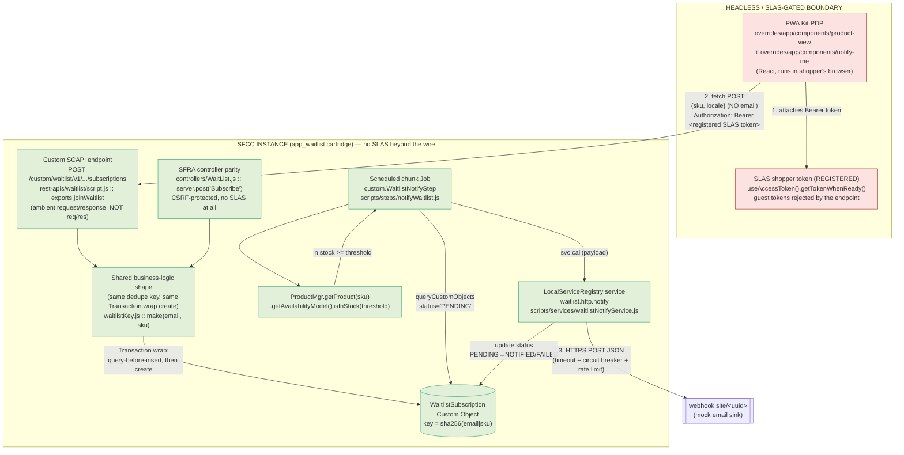
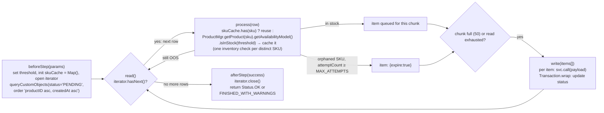
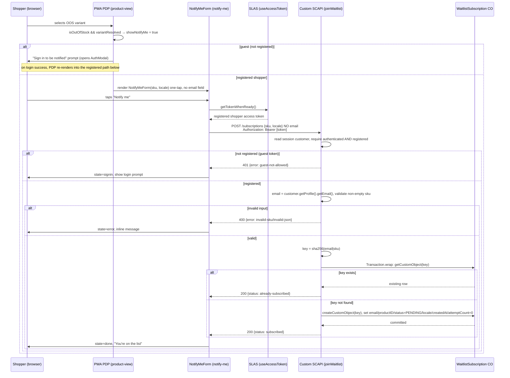
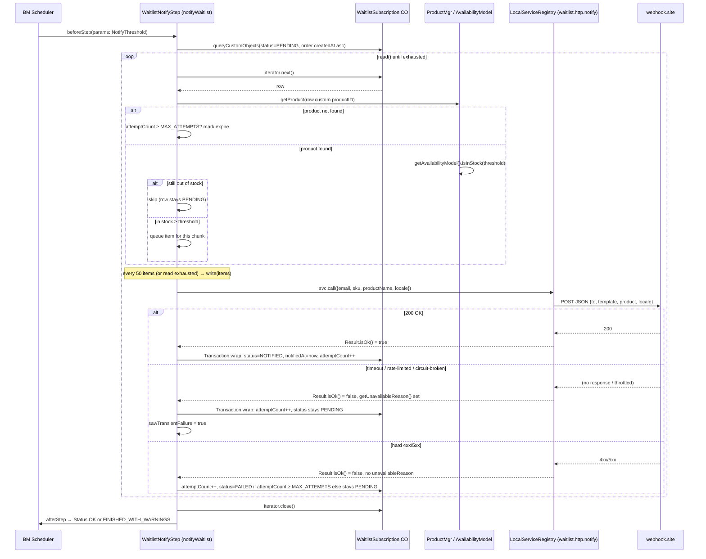

# High-Level Design — Back-In-Stock Waitlist Engine

Status: **DESIGN DRAFT — not yet implemented / not yet reviewed.** This document
describes the intended architecture for the take-home. It is grounded in the
source that already exists in this workspace (see "Source grounding" below);
where that source is a stub or sketch rather than production-ready code, this
document says so explicitly and states the design intent.

**Companion doc:** `docs/UI-DESIGN.md` owns the deep PDP/UI interaction spec
(exact component states, copy, a11y, visual layout). This HLD stops at the
system/state-machine level for the frontend (Section 7) and hands off to that
doc for anything below "which state is the PDP in."

### DECISIONS LOCKED (post-review, 2026-08-28) — these override any hedge below

The design open-questions in this doc were reviewed and resolved. Where the
text below (esp. §7, §8, §12) hedges, **these decisions win:**

1. **Partial stock (requested qty > available, e.g. want 6 / 5 in stock) → NOT a
   Notify-Me case.** Notify Me is offered **only when the resolved variant is
   fully out of stock** (`stockLevel === 0` / not orderable). When some stock
   exists but less than the requested quantity, we leave the base
   retail-react-app behavior (inline inventory message, Add-to-Cart capped to
   `stockLevel`) untouched and do **not** show a waitlist affordance. This keeps
   §7's original rule — *"must not simultaneously offer Notify Me for a
   still-orderable SKU"* — as-is. **Rationale:** a split buy box ("add the 5,
   waitlist the 6th") is not a mainstream B2C pattern (real storefronts are
   binary per SKU; the "want more than exists" case is a B2B *backorder*
   convention, not a consumer waitlist), so it was cut as over-engineering. The
   only "partial" concern we keep is the **backend** partial-*restock* fairness
   logic (item 3 below) — that is required by the brief and unaffected by this.
2. **Registered users only — authenticated, server-derived email** (reverses the earlier
   "guest inline email" decision, 2026-08-30). The subscribe request carries **no
   client-supplied email**; the endpoint derives the address from the authenticated SLAS
   token / customer record. A **guest** is not allowed to subscribe — the PDP shows a "Sign
   in to be notified" prompt that opens the existing `AuthModal`, and on login the shopper
   drops into the one-tap path (UI-DESIGN §3.1/§3.2). **Rationale:** letting an anonymous
   shopper type any address is an abuse vector (mass-subscribe arbitrary third parties per
   SKU) and every such address is unverified (bounces/spam-complaints against the sending
   domain). Binding every subscription to a **verified, account-owned** email eliminates the
   arbitrary-recipient vector at the source. This changes the API contract (§4), the data
   model's email provenance (§3), and the security posture (§10).
3. **Inventory freshness = hybrid, not pure poll** (added 2026-08-30). The notify job is a
   **reconciliation cron** (safety net for manual BM stock edits, missed deltas, and
   transient-failure retries), and the **event-primary** path is a notify step **chained
   after the inventory import job** so a restock notifies within seconds of the feed landing,
   scoped to the SKUs that changed. There is **no** record-level inventory trigger on B2C
   Commerce; the import job is the real event surface. OCI availability events are the
   enterprise path (named, not built). See §5 "Schedule / trigger."
4. **Job cost is O(distinct pending SKUs), one Custom Object** (added 2026-08-30). The job
   keeps a **step-scoped availability cache** (`Map<sku, inStock>`) and reads `PENDING` rows
   sorted `custom.productID asc, custom.createdAt asc`, so it does **one inventory check per
   waiting SKU** (not per subscription) while preserving FIFO fairness within a SKU. No
   second index object is built — a `WaitlistSku` counter object is documented as a
   scale lever (§9), not paid for up front (it adds counter-drift risk). See §5/§9.
5. **Build ALL of the following now (not deferred to future work):**
   - **TTL/cleanup job step** (closes §8/§9/§12 gap #2 + doubles as the
     PII-retention control).
   - **Already-subscribed detection** — the custom SCAPI POST response returns a
     distinguishable `already-subscribed` status on a dedupe hit, and the PWA
     renders the distinct idempotent state (§12 gap #7 / UI-DESIGN §5.4). Across
     a refresh the PWA reads a zero-latency `localStorage` hint on mount — **not**
     a per-view server read; the write is idempotent so a re-click is harmless.
     A `getWaitlistStatus` GET endpoint exists for an authoritative/cross-device
     account view but is kept OFF the PDP critical path (see the decision-history
     note in UI-DESIGN §5.4, reverted 2026-08-30).
   - **Shared subscribe module** — factor the duplicated validate/key/transaction
     logic out of `rest-apis/waitlist/script.js` and `controllers/WaitList.js`
     into one `scripts/` include both call (closes §12 gap #6).
   - **Partial-restock reservation counter** — track units-claimed-this-run so a
     thin restock cannot over-notify (closes §8 partial-restock gap / §12 gap #3).
6. **Merchant demand-report layer — BUILT (2026-08-31), supersedes the "raw BM
   Custom Object list view" stopgap.** Deliverable 3 is now a real merchant surface,
   not a framing of the auto-generated CO grid (which only renders the opaque
   sha256 key column, so the SKU/count were never visible there). Built as three
   pieces sharing ONE aggregation code path: (a) a channel-agnostic
   `scripts/helpers/waitlistDemand.js` module (group `WaitlistSubscription` rows by
   `productID`, count by status, join live availability, rank OOS-with-demand
   first); (b) a `bm_waitlist` BM extension cartridge rendering a ranked table +
   CSV download under Merchant Tools › Products and Catalogs; (c) a
   `custom.WaitlistDemandReport` job step that writes the same ranked CSV to IMPEX
   on a schedule. Read-only by design (no send-triggering action on the page). See
   §5A.

### ENVIRONMENT & DEPENDENCY STATUS (confirmed 2026-08-29)

Concrete facts about the Adyen-provisioned sandbox and the one external dependency
(SLAS). This supersedes any looser "the sandbox this workspace points at" phrasing
below (esp. §1 non-goals, §12 gap #7).

- **Deploy target sandbox:** `zzft-025` (`Sandbox - ZZFT_025`, POD 8004, compat mode
  22.7). Short Code `j1jska9w`, Organization ID `f_ecom_zzft_025`, Tenant `zzft_025`,
  one site **"Waitlist Demo"** (active code version `version1`, **0 cartridges deployed**
  — the target for `app_waitlist`). The candidate holds **BM Administrator** here, which
  is sufficient to WebDAV-deploy the cartridge, register the custom SCAPI endpoint,
  import metadata, and create/run the Service and Job.
- **Where SLAS actually sits (corrected mental model):** SLAS gates **only** whether a
  *browser* can obtain a shopper token to call the custom SCAPI endpoint over the wire
  (the red box in §2). It does **not** gate authoring, deploying, or registering the
  endpoint; the Custom Object; the Job; the Service; the SFRA controller; or metadata
  export. The custom API is deployed to `zzft-025` **now, independent of SLAS** — it is
  callable *with a token* the moment the code version is activated.
- **SLAS status — blocked on Adyen, off the critical path.** Self-provisioning a client
  via the SLAS Admin UI (`https://j1jska9w.api.commercecloud.salesforce.com/shopper/auth-admin/v1/ui/`)
  returned **"Unauthorized – no SLAS role found"**: the candidate's Account Manager user
  lacks the **SLAS Organization Administrator** role for tenant `zzft_025`, which only an
  Account Administrator (Adyen) can grant. Ask sent to recruitment: (A, preferred) grant
  that role so the candidate self-serves the client; or (B) Adyen provisions a **public**
  client and sends the Client ID with `http://localhost:3000/callback` registered.
- **The SFRA controller is a *permanent* parallel path, not a temporary stand-in.** It
  proves the identical Custom-Object write with zero SLAS (CSRF-protected) and remains in
  the deliverable even after the PWA live path works — it is how the real write path is
  demonstrated on `zzft-025` regardless of SLAS timing (see §4).
- **Two-tier demo consequence:** on localhost-against-the-shared-demo-instance the PWA
  runs in `MOCK_MODE` (no server call — the demo instance can't host our endpoint); the
  real write path is proven on `zzft-025` via the SFRA controller and the Job (both
  SLAS-free); the live headless-shopper token path is demoed on `localhost:3000` (whose
  `/callback` is registered on the shared demo SLAS client) once a usable client exists.
  The MRT hosted URL's live guest login 400s on `redirect_uri` because the shared
  Salesforce-managed client's allowlist can't be edited to add the MRT domain — a
  client-ownership limitation, not a code bug (see `docs/DELIVERY-PLAN.md` Appendix A.9).
- **Testing is an explicit evaluation axis.** The take-home brief's Step 2 names
  *"testing methodologies (e.g., Jest/Playwright)"* — see the new §13 Testing strategy.

### Source grounding

| Concern | File |
|---|---|
| Custom SCAPI endpoint impl | `back-in-stock-cartridge/app_waitlist/cartridge/rest-apis/waitlist/script.js` |
| Custom SCAPI schema (OpenAPI) | `back-in-stock-cartridge/app_waitlist/cartridge/rest-apis/waitlist/schema.yaml` |
| Custom SCAPI endpoint registration | `back-in-stock-cartridge/app_waitlist/cartridge/rest-apis/waitlist/api.json` |
| Chunk job step | `back-in-stock-cartridge/app_waitlist/cartridge/scripts/steps/notifyWaitlist.js` |
| Outbound service definition | `back-in-stock-cartridge/app_waitlist/cartridge/scripts/services/waitlistNotifyService.js` |
| Dedupe key util | `back-in-stock-cartridge/app_waitlist/cartridge/scripts/util/waitlistKey.js` |
| SFRA parity controller | `back-in-stock-cartridge/app_waitlist/cartridge/controllers/WaitList.js` |
| Custom Object schema (XML) | `back-in-stock-cartridge/metadata/back_in_stock/meta/custom-objecttype-definitions.xml` |
| Job step registration | `back-in-stock-cartridge/app_waitlist/steptypes.json` |
| Merchant demand aggregation (shared) | `back-in-stock-cartridge/app_waitlist/cartridge/scripts/helpers/waitlistDemand.js` |
| Demand-report export job step | `back-in-stock-cartridge/app_waitlist/cartridge/scripts/steps/waitlistDemandReport.js` |
| BM extension registration | `back-in-stock-cartridge/bm_waitlist/cartridge/bm_extensions.xml` |
| BM report controller | `back-in-stock-cartridge/bm_waitlist/cartridge/controllers/WaitlistReport.js` |
| BM report template | `back-in-stock-cartridge/bm_waitlist/cartridge/templates/default/extensions/waitlist/report.isml` |
| PWA Notify Me component | `waitlist-storefront/overrides/app/components/notify-me/index.jsx` |
| PWA PDP integration | `waitlist-storefront/overrides/app/components/product-view/index.jsx` |
| Original blueprint (reshaped below) | `back-in-stock-assignment.md` |

---

## 1. Overview & goals / non-goals

### Problem statement

SFCC B2C Commerce has no native back-in-stock notification feature, and no
PWA Kit reference implementation exists. When a shopper lands on a PDP for a
variant/SKU that is out of stock (or wants more units than are currently
available-to-sell), the only platform behavior is to disable Add-to-Cart —
the shopper has no way to ask to be told when the SKU comes back. This design
adds that capability entirely from platform primitives: a Custom SCAPI
endpoint, a Custom Object, a scheduled chunk job, and the Services framework.

### Goals

- Let a **registered (signed-in)** shopper subscribe to be notified when a specific
  **variant** SKU becomes orderable again, from the PWA Kit PDP. The notified address is the
  shopper's **authenticated account email, derived server-side** — never a value the client
  chooses or sends. Guests are prompted to sign in first (see §7 and UI-DESIGN §3.2).
- Persist subscriptions durably and idempotently — a duplicate signup for the
  same `(email, sku)` pair must not create a second row.
- Detect replenishment through a **hybrid** trigger: a reconciliation batch job that checks
  real inventory (`ProductMgr` / `ProductAvailabilityModel`), not a cached or client-side
  snapshot, **plus** a notify step chained after the inventory import job for near-real-time
  notification on the SKUs a feed just changed (§5).
- Simulate the outbound notification (email) via a real HTTP call to a mock
  endpoint (`webhook.site`), routed through the Services framework so the
  resilience story (timeout, circuit breaker, rate limiting) is real and
  demonstrable, not hand-waved.
- Support both storefront stacks: PWA Kit (headless, SLAS-gated) as primary,
  SFRA controller as parity, both writing through the **same** business-logic
  shape (idempotent create-by-key against the same Custom Object).

### Non-goals / explicit scope boundaries

- **No real email is sent — by design, per the brief.** Requirement 3 says to
  *"simulate sending an email by securely calling an external mock REST API
  (e.g., Webhook.site)"* — the evaluated concern is the outbound-integration and
  resilience pattern (secure call, timeout, rate limit, retry, model update),
  **not** deliverability. "Notify" therefore means "POST a JSON payload to a
  webhook.site URL a human can inspect," with no ESP/SMTP and no email-template
  rendering. **The notify channel is deliberately pluggable:** it is a
  `LocalServiceRegistry` service (§6), so swapping the mock sink for a real
  channel — `dw.net.Mail` (B2C's native email class) + ISML template rendering,
  SendGrid, or Salesforce Marketing Cloud — is a Service credential/config change
  with **zero job-code diff**. That extensibility is called out in the README,
  not built.
- **Single sandbox, single site.** No multi-site/multi-locale campaign
  logic beyond carrying a `locale` string through to the payload. No
  cross-instance replication story.
- **Merchant-facing surface = a purpose-built BM demand-report page + CSV export
  (BUILT 2026-08-31).** The demo's *required* merchant-facing half (deliverable 3)
  is served by a dedicated `bm_waitlist` Business Manager extension cartridge that
  renders a ranked *waiters-per-SKU* table under **Merchant Tools › Products and
  Catalogs › Waitlist Demand Report**, plus a schedulable job step that writes the
  same ranked data to IMPEX as CSV. Both consume one shared aggregation module.
  This **supersedes** the earlier stopgap of reading the raw BM Custom Object list
  view (whose grid only ever shows the opaque sha256 key column — see §3 key
  strategy — so a merchandiser could never see the SKU/count there without opening
  each record). See **§5A** for the full design. (What remains under the cut-line
  is a *write* action from that page — one-click "run notify now" — named, not
  built: the report is read-only by design so it can't accidentally fire sends.)
- **No unsubscribe / preference center in the built scope — but documented as an
  identified edge case (deliverable 4).** The brief doesn't require it, so no
  preference center is built and a subscriber can't self-remove a row in this
  iteration. Because unsubscribe is a real CAN-SPAM/GDPR concern, the README
  names it with the design sketch (a tokenized `WaitList-Unsubscribe` route →
  delete the CO row by key; see Section 12 gap #5). A minimal tokenized route is
  an *under-the-cut-line* stretch, not core scope.
- **No push/SMS channel.** Email (mocked) only.
- **Registered-users-only; the email is authenticated, not typed.** A subscription is keyed
  on the shopper's **verified account email, resolved server-side from the SLAS token /
  customer record** — the client never supplies an address. Guests cannot subscribe (they
  get a sign-in prompt). This is a deliberate reversal of an earlier guest-inline-email
  design; see Section 3 for the key strategy and Section 10 for the security payoff.
- **PWA Kit component is currently wired in `MOCK_MODE`** (see
  `overrides/app/components/notify-me/index.jsx`): it does not yet POST to a
  real sandbox because the shared demo instance this workspace points at cannot
  host our custom endpoint, and the live headless-shopper call to the endpoint
  once deployed to `zzft-025` needs a usable SLAS client (blocked on Adyen — see
  the Environment & Dependency Status block above and §12 gap #7). This HLD
  designs the live path (`submitLive`) that the code already stubs out and gates
  behind `WAITLIST_LIVE=true`. The endpoint deploy itself is **not** SLAS-blocked.

---

## 2. Architecture

### Component diagram

The critical architectural fact driving this design: **PWA Kit is a
standalone React app with no server-side SFCC context.** It only ever talks
to SFCC over HTTP, through SCAPI, using a SLAS shopper access token. That
means SLAS gates exactly one thing in this whole system — the browser's live
call to the custom endpoint. Everything to the right of that boundary (the
endpoint's own business logic, the Custom Object, the job, the outbound
service call) runs entirely inside the SFCC server process under its own
job/OCAPI trust model and is never touched by a SLAS token.



**Reading the boundary:** the red box is the only part of the system that
knows about a SLAS token. The SFRA controller path (`WaitList.js`) proves
this by construction — it writes to the exact same Custom Object via the
exact same key-derivation logic, protected only by CSRF, with **zero** SLAS
involvement. The Job, the Service call, and every read/write against
`WaitlistSubscription` likewise run with no SLAS token in scope — they are
server-side batch/administrative execution.

### Why a Custom SCAPI endpoint, not a hook or OCAPI

- **Hooks** can only extend resources that already exist (basket, order,
  customer, product...). They cannot introduce a net-new URL, so there is no
  hook point for "accept an arbitrary signup form POST."
- **OCAPI** is legacy/deprecated for new PWA Kit work; SCAPI is the paved
  path for anything headless.
- A **Custom SCAPI endpoint** (`rest-apis/waitlist/{schema.yaml,api.json,script.js}`)
  is therefore effectively the only way to give the PWA a net-new authenticated
  write surface. It is activated simply by activating the code version that
  contains `rest-apis/` — no `hooks.json` entry needed.

---

## 3. Data model — `WaitlistSubscription` Custom Object

### Why a Custom Object (vs. alternatives)

| Alternative | Why rejected |
|---|---|
| Profile custom attribute (`customer.custom.*`) | Even though the feature is now registered-only (so a Profile *does* exist), this is the wrong shape: the job's core query is *"all rows waiting on SKU X, oldest first"* — you cannot efficiently ask that of profile attributes (no cross-profile query by a nested attribute), and "one shopper waiting on N SKUs" would need a serialized sub-list on one attribute, not per-SKU queryable. It also couples the waitlist row's lifecycle (`PENDING→NOTIFIED→TTL-purge`) to the customer record, which we deliberately keep independent. |
| External datastore (own DB/microservice) | Adds a network hop, a new credential, and a new deploy artifact for no benefit — SFCC already ships a first-class primitive for exactly this shape (arbitrary key→attributes record, queryable, exportable via Site Import). Would also reintroduce the SLAS-boundary problem: the PWA would need yet another auth story to write to it directly, or SFCC would need to proxy it anyway. (This is the store you'd move to *past* the CO cap — see §9.) |
| Custom Object (chosen) | Native, queryable and **sortable by `productID`/`status`** (`CustomObjectMgr.queryCustomObjects`) — exactly the shape the notify job iterates — exportable as XML metadata, lifecycle-independent of the customer record, and the primitive the platform's own chunk-step tooling is built to page over. |

### Attribute definitions (from `custom-objecttype-definitions.xml`)

`type-id="WaitlistSubscription"`, `storage-scope: site`, `staging-mode: no-staging`.

| Attribute ID | Type | Mandatory | Purpose |
|---|---|---|---|
| `subscriptionKey` (key-definition) | `string` | — | The Custom Object **key** itself (not a regular attribute). Set at `createCustomObject('WaitlistSubscription', key)` time. |
| `email` | `string` | true | Subscriber's **authenticated account email**, resolved server-side from the SLAS token / customer record (never sent by the client); lower-cased and trimmed before write. |
| `productID` | `string` | true | **Variant SKU**, never the master product ID — inventory is resolved per-variant (see Section 5). |
| `status` | `enum-of-string` | true | `PENDING` (default) / `NOTIFIED` / `FAILED`. Drives the whole idempotency story — see below. |
| `locale` | `string` | false | Carried from the request (`body.locale` or `request.locale`) through to the outbound payload. |
| `createdAt` | `datetime` | false | Set once at signup; used to order the job's read as `custom.createdAt asc` (oldest-first / FIFO fairness). |
| `notifiedAt` | `datetime` | false | Set only on a successful `NOTIFIED` transition. |
| `attemptCount` | `int` | false | Incremented once per job pass that resolves this row to a notify attempt; drives the `MAX_ATTEMPTS` age-out in `notifyWaitlist.js`. |

All fields are grouped under a single `general` attribute-group in the XML —
there is no additional grouping needed for a schema this small.

### Key / index strategy — the sha256 dedupe key

`waitlistKey.js` computes:

```
key = sha256( lower(trim(email)) + '|' + sku )   // hex digest, via dw/crypto/MessageDigest
```

**Why hash instead of a raw composite string like `email__sku`:** Custom
Object keys are length- and charset-constrained, and raw emails contain `@`,
`.`, `+` characters that are awkward in a key (and in any URL built from
one). A sha256 hex digest is fixed-length, charset-safe, and — for our
purposes — collision-proof. The same `(email, sku)` pair always maps to the
same key, so a second signup for the same pair is not a "new row," it is a
lookup hit on the same key.

**Idempotency/uniqueness guarantee — read the code's own comment closely,
because it states the actual guarantee precisely:** the key is **defense in
depth**, not the primary guard. Both write paths (`rest-apis/waitlist/script.js`
and `controllers/WaitList.js`) wrap the check-and-create in
`Transaction.wrap`, and *inside* that transaction they explicitly do
`CustomObjectMgr.getCustomObject('WaitlistSubscription', key)` first and only
call `createCustomObject` if that lookup returns nothing. The code comment in
`waitlistKey.js` says this directly: *"the platform behavior of
createCustomObject() on an existing key is undocumented"* — so the real
uniqueness guarantee is the **query-before-insert pattern inside a single
transaction**, and the hash key is there so that a duplicate signup collides
at the key layer (i.e., dedupe is deterministic and cheap to check) rather
than as a substitute for the transactional check. This is flagged again as
an open platform risk in Section 12.

### Why key on the email, not the Customer/Profile ID

The feature is registered-only, so a stable `customerId` *is* available — we could key on
`sha256(customerId|sku)`. We deliberately key on the (authenticated) **email** instead, for
two reasons:

1. **The notify step needs the address anyway.** The outbound payload is `{to: email, ...}`;
   keying and storing on the email means the job never has to do a second customer lookup at
   send time to resolve an ID back to an address.
2. **The email is the notification identity.** If a shopper changes their account email, a
   subscription made under the old address is arguably stale — keying on the address makes
   that explicit rather than silently re-targeting.

Because the email is now **server-derived and verified** (not a typed string), the old risk
this section used to flag — *"the same person under two different emails gets two rows, no
way to merge a guest email with a later Customer record"* — is **largely eliminated**: there
is one verified email per account, and no guest path to create an unverified row in the first
place. The residual case (a shopper who changes their account email and re-subscribes)
produces a second row under the new address, which is the correct behavior. See Section 12.

---

## 4. API design

### Custom SCAPI endpoint (primary, SLAS-gated path)

- **Method / path:** `POST /custom/waitlist/v1/organizations/{organizationId}/subscriptions?siteId={siteId}`
  (from `schema.yaml`: `servers[0].url` is
  `https://{shortCode}.api.commercecloud.salesforce.com/custom/waitlist/v1`,
  `info.version: 1.0.0` drives the `v1` URL segment, `operationId: joinWaitlist`
  maps 1:1 to the exported function name in `script.js` — Custom SCAPI requires
  that match).
- **Auth:** `security: [{ ShopperToken: [] }]` — HTTP bearer, SLAS shopper JWT.
  `exports.joinWaitlist.public = true` in `script.js` exposes the operation on
  the shopper-authenticated surface (as opposed to an org-admin-only custom
  API). **Registered-only:** the endpoint reads the current customer from the
  request session (`var customer = request.getSession().getCustomer()`) and
  **rejects any token that is not an authenticated, registered shopper** —
  `if (!customer || !customer.authenticated || !customer.registered) → 401`.
  The email is then taken as `customer.getProfile().getEmail()`; the client
  neither supplies nor can override it. **Scope minimization:** the endpoint
  reads exactly one profile field (the caller's own verified email) via the
  session customer already attached to the request — it requests no
  order-history or cross-customer PII scope.
- **Request body** (`SubscriptionRequest` in `schema.yaml`):
  ```json
  { "sku": "701644398258M", "locale": "en_US" }
  ```
  `sku` is `required`; `locale` is optional (falls back to `request.locale`
  server-side). **There is no `email` field** — the front/back contract is
  **`{sku, locale}`**, and the address is derived server-side from the
  authenticated customer. `overrides/app/components/notify-me/index.jsx`'s
  `submitLive()` sends only `{sku, locale}`.
- **Response** (`SubscriptionResponse`):
  ```json
  { "status": "subscribed", "sku": "701644398258M" }
  ```
  or
  ```json
  { "status": "already-subscribed", "sku": "701644398258M" }
  ```
- **Status codes:**
  | Code | Meaning | Source condition in `script.js` |
  |---|---|---|
  | `200` | Created OR already existed | Both the fresh-insert and the dedupe-hit path return `RESTResponseMgr.createSuccess(...)` — **the API is intentionally idempotent at the HTTP-status level.** There is no `409`; `already-subscribed` is a `200` payload variant, not an error. The PWA form treats this as "success-equivalent" for the shopper. |
  | `401` | `not-authenticated` / `guest-not-allowed` | The token is missing, guest, or not a registered shopper. This is the enforcement point for the registered-only rule — a guest can never create a row. |
  | `400` | `invalid-json` / `invalid-sku` | Malformed body, or empty/missing sku. (No `invalid-email` — the client never sends an email.) |
  | `500` | `persistence-error` | `Transaction.wrap` throws (caught and logged via `Logger.getLogger('waitlist','subscribe')`). |
- **Server-side validation:** the identity check above is the gate. The **email
  is not validated against a regex** — it comes from the verified customer
  profile, not from input, so there is no untrusted email to sanitize (it is
  still lower-cased/trimmed for canonical key derivation). `sku` is trimmed and
  must be non-empty. This is a net *reduction* in trusted-input surface versus
  the earlier design.

- **Status read (`GET`, off the PDP critical path).** A companion
  `getWaitlistStatus` operation —
  `GET .../subscriptions?siteId=...&sku=<sku>` returning
  `{ "subscribed": bool, "sku": ... }` — reports whether the *authenticated
  caller* is on the list for a SKU. The email is derived from the token (never
  input), so a token can only ever probe its own state and a guest token is
  simply `subscribed:false` (fail-open 200). **The PDP does not call this on
  load:** the write is idempotent, so re-clicks are harmless and a per-view
  authenticated round-trip on the storefront's hottest page isn't worth the
  latency; the PWA uses a zero-latency `localStorage` hint for the
  refresh-survives-subscription UX instead. The endpoint is retained for an
  authoritative/cross-device account "my waitlist" view. (Decision history:
  a mount-time GET was tried and reverted — UI-DESIGN §5.4, 2026-08-30.)

### SFRA controller parity (no-SLAS doorway)

- **Route:** `WaitList-Subscribe` (`server.post('Subscribe', server.middleware.https,
  userLoggedIn.validateLoggedInAjax, csrfProtection.validateAjaxRequest, ...)` in
  `controllers/WaitList.js`).
- **Auth model:** none from SLAS — this route is reached by a same-origin
  server-rendered page's own session, protected by **login-required middleware**
  (`userLoggedIn.validateLoggedInAjax`) **plus CSRF** token validation
  (`csrfProtection.validateAjaxRequest`). The login gate is the SFRA-side
  enforcement of the registered-only rule; CSRF protects request authenticity.
  This is the point of parity: it demonstrates the identical business-logic
  write is reachable from a storefront stack that has *no* concept of a SLAS
  shopper token at all, because SFRA pages are rendered server-side inside the
  same SFCC session that terminates the browser request.
- **Contract:** same `{email, sku, locale}` shape *into the shared module*, but the
  **email is sourced from the session** (`req.currentCustomer.profile.email` /
  `customer.getProfile().getEmail()`), never from `req.form` — only `sku` and
  `locale` come from the request (`req.form.sku` / `req.locale.id`). Same
  `waitlistKey.js :: make(email, sku)`, same `Transaction.wrap`
  query-before-insert. Response is `res.json({success, status})` rather than a
  REST envelope, but the `status` values (`subscribed` / `already-subscribed`)
  match the SCAPI contract 1:1.
- **This is the proof that SLAS is a transport-layer concern, not a
  business-logic dependency:** both doorways call into the same shape of
  logic (currently duplicated between the two files rather than factored into
  one shared module — see Section 12 for the refactor this implies) against
  the same Custom Object, with the same key derivation. Neither doorway
  touches the Job or the Service.

---

## 5. The notify job

### Why chunk-oriented, not a Task step

Bulk iteration over the waitlist with fixed-size batching of outbound HTTP
calls is exactly the chunk-step pattern's purpose: read many, process many,
write a bounded batch, repeat. A Task step is single-shot and would have to
reimplement batching by hand. `steptypes.json` registers
`custom.WaitlistNotifyStep` as a `chunk-script-module-step` with
`chunk-size: 50`, `transactional: false`, and
`@supports-parallel-execution: false`.

### Lifecycle — the only four+two hooks a chunk step actually has

The code comment in `notifyWaitlist.js` is explicit that this is the full
set — there is **no** `beforeRead`/`afterProcess`/etc. — only
`beforeStep`/`afterStep` (once per step execution) and
`beforeChunk`/`afterChunk` (once per chunk; unused here), plus the three
per-item functions:



- **`beforeStep(params)`:** reads the BM job parameter `NotifyThreshold`
  (default `1`) — the minimum available-to-sell quantity required before
  notifying; initializes a **step-scoped availability cache** (`var skuCache =
  {}` / a `Map`, lives for the whole step run); opens a `SeekableIterator` via
  `CustomObjectMgr.queryCustomObjects('WaitlistSubscription', 'custom.status
  = {0}', 'custom.productID asc, custom.createdAt asc', 'PENDING')`. **The sort
  is doing two jobs:** grouping rows by SKU (so the cache's benefit is maximal
  and its working set is contiguous) and, as the *secondary* key, preserving
  oldest-first FIFO fairness **within each SKU** under partial replenishment.
  (Global cross-SKU FIFO is irrelevant — different SKUs never compete for the
  same units.)
- **`getTotalCount()`:** `iterator.count` — feeds BM's job-monitor progress bar.
- **`read()`:** returns `iterator.next()` one row at a time;
  returning `undefined` ends the read loop (documented chunk-step contract).
- **`process(row)`** — **this is where variant-level inventory resolution
  happens, deduped per SKU.** For `sku = row.custom.productID`: if `skuCache`
  already has a decision for that SKU, reuse it; otherwise call
  `ProductMgr.getProduct(sku)` (the stored value is the variant SKU, never a
  master ID) and `.getAvailabilityModel().isInStock(threshold)`, and store the
  result in `skuCache`. **This is the single-object O(distinct-SKU) mechanism:**
  100k `PENDING` rows spread over 2k out-of-stock SKUs cost 2k inventory checks,
  not 100k — no second index object needed. If the product no longer resolves
  (deleted/offline), age the row out to `{expire: true}` once `attemptCount >=
  MAX_ATTEMPTS` (`= 5`), otherwise skip (`undefined`) and leave it `PENDING`
  for a later pass in case it's a transient catalog-sync gap. If it resolves,
  the (cached) `isInStock(threshold)` decides restocked vs. still-OOS; still-OOS
  returns `undefined`, which **skips the row and leaves it `PENDING`** — no
  error, just "not yet." (`getProduct` results are not cached across job runs —
  only within a single run — so a mid-run restock is still picked up on the very
  next scheduled/import-chained pass.)
- **`write(items)`** — called once per chunk (≤50 items) with the accumulated
  array. For each item: if `expire`, transition straight to `FAILED`. Otherwise
  call `svc.call({email, sku, productName, locale})` and, inside a per-row
  `Transaction.wrap`, increment `attemptCount` and branch:
  - `result.isOk()` → `status = 'NOTIFIED'`, stamp `notifiedAt`.
  - not ok, but `result.getUnavailableReason()` is truthy (rate-limited /
    circuit-broken / timed out) → **leave `PENDING`**, log a scrubbed warning,
    set the step-level `sawTransientFailure` flag.
  - not ok, no unavailable-reason (a hard 4xx/5xx from the service itself),
    and `attemptCount >= MAX_ATTEMPTS` → `FAILED`.
  - otherwise → leave `PENDING` (retry next run).
- **`afterStep(success)`:** **always** `iterator.close()` — mandatory
  `SeekableIterator` hygiene, done unconditionally even if the step is being
  torn down. Returns `Status.OK` normally, or `Status(Status.OK,
  'FINISHED_WITH_WARNINGS', ...)` if any row hit a transient failure this run
  — matching the three `status-codes` declared in `steptypes.json`
  (`OK`/`ERROR`/`FINISHED_WITH_WARNINGS`).

### Schedule / trigger — hybrid (event-primary + reconciliation)

**There is no record-level inventory trigger or platform event on B2C Commerce** — you
cannot hook "stock changed." So "trigger the notify the moment inventory arrives" is achieved
by attaching to the real event surface, and the recurring job becomes the safety net rather
than the only mechanism:

1. **Event-primary — chain the notify step after the inventory import job.** Inventory lands
   in bulk via the `ImportInventoryLists` feed; that job flow *is* the moment stock changes.
   Register `custom.WaitlistNotifyStep` as a step **immediately after** the import step in the
   same job (or a job triggered on the import's completion), so a restock notifies within
   seconds of the feed — not on the next poll tick. If the import delta/manifest is available,
   pass the changed-SKU set into the step so it only checks those SKUs. This is what closes
   the **latency** concern for high-demand products, where a 15-minute poll lag would mean the
   units resell before the email goes out.
2. **Reconciliation — recurring `custom.WaitlistNotifyStep` on a schedule.** Configured in BM
   (Administration → Operations → Jobs), e.g. every **2–5 minutes**. This catches what the
   import path can't: **manual BM stock edits**, feed deltas that didn't cleanly map to
   waiting SKUs, and — critically — **retrying rows left `PENDING`** by a prior transient
   service failure. It is cheap to run this often precisely because of the O(distinct-SKU)
   cache above: an idle run (nothing restocked) does one inventory check per waiting SKU and
   exits; it does **not** scan or notify all-time signups.

Both paths run the identical step code (same cache, same `write()` transitions), so there is
no divergence risk. **A job cannot start a second concurrent run of itself while a previous
run is still executing** — the platform's own re-entrancy guard — so overlapping the frequent
reconciliation schedule with an import-triggered run is safe by construction, and the *only*
real concurrency risk in this design stays at the inbound-signup side (Section 4/8), not the
job side. **OCI (Omnichannel Inventory) availability-change events** are the enterprise-grade
event source (true push, cross-channel) — named as future work, not built (likely
unprovisioned on this sandbox).

### Failure / retry behavior, summarized

The whole "safe to re-run" story is: **a row only ever leaves `PENDING` on a
*definitive* outcome** (`NOTIFIED` on confirmed send, `FAILED` on confirmed
hard failure or age-out). Every ambiguous/transient case — still out of
stock, service timeout, rate-limited, circuit-broken — leaves the row
`PENDING` and lets the next scheduled run pick it back up. Because the job
only ever *reads* `PENDING` rows, a `NOTIFIED` row is structurally guaranteed
never to be re-read, which is the mechanism (not a promise) behind
"idempotent notification." The one residual gap — a crash between a
successful `svc.call()` and the `Transaction.wrap` status commit — is an
**at-least-once**, not exactly-once, guarantee; that's named explicitly as an
accepted risk in Section 8/12, not hidden.

---

## 5A. Merchant demand report — BM page + shared module + export job (deliverable 3)

**Built 2026-08-31.** Deliverable 3 asks for a merchant-facing way to see demand.
The honest constraint that shaped this: **Business Manager's auto-generated Custom
Object list view only ever renders the object's *key* column** (plus scope / last-
modified / expiry). Our key is `sha256(email|sku)` (§3), so that grid shows a wall
of opaque hashes — a merchandiser cannot see *which SKU* or *how many waiters* there
without opening each record one at a time, and there is no native GROUP-BY /
aggregation over custom objects (confirmed: native Reports & Dashboards aggregate
predefined sales/traffic feeds only, not arbitrary COs). So a purpose-built surface
is required, not optional polish.

### Design: one aggregation, two surfaces

```
                       scripts/helpers/waitlistDemand.js   (dw/* only; BM-safe)
                       build(): group by productID, count by status,
                       join ProductMgr availability, rank, priority
                          ▲                              ▲
                          │ require('*/…/waitlistDemand')│
        ┌─────────────────┴───────┐        ┌─────────────┴───────────────┐
        │ bm_waitlist (BM cart.)  │        │ app_waitlist job step        │
        │ WaitlistReport.js       │        │ steps/waitlistDemandReport.js│
        │  Start → ISML table     │        │  execute → CSV to IMPEX      │
        │  Export → CSV download  │        │  (schedulable / BI feed)     │
        └─────────────────────────┘        └──────────────────────────────┘
```

The **shared module is the whole point**: the live BM page and the scheduled CSV
export can never disagree on how demand is counted or ranked because they call the
same `build()`. It uses only server-side `dw/*` APIs (`CustomObjectMgr`,
`ProductMgr`), so it is safe to run in the BM controller context, the job context,
and unit tests alike.

- **Aggregation (`waitlistDemand.build`)** — `CustomObjectMgr.getAllCustomObjects`
  is iterated **once** (no GROUP BY exists) and tallied into a `Map<sku, {waiting,
  notified, failed, total}>` keyed on `custom.productID`. For each SKU it joins live
  availability via `ProductMgr.getProduct(sku).getAvailabilityModel().isInStock()`
  and assigns a restock **priority**: `IN_STOCK` (available now — the notify job will
  drain it), `HIGH`/`MEDIUM`/`LOW` (out of stock, by waiting count ≥10/≥3/≥1),
  `REVIEW` (product no longer resolves — offline/deleted), `NONE` (only fulfilled/
  failed rows remain). Rows are ranked **actionable-restock-first**: priority, then
  waiting count desc, then SKU for a stable order. The iterator is always closed.
- **Channel-agnostic by construction.** The SFRA controller and the PWA SCAPI
  endpoint both write the identical `WaitlistSubscription` row via the shared
  `waitlistSubscribe` helper, so this reader neither knows nor cares which storefront
  produced a row — it aggregates persisted data only. That is what makes one report
  correct for both SFRA and PWA (the original research question behind this build).
- **BM surface (`bm_waitlist`).** A standard BM extension cartridge
  (`bm_extensions.xml`, namespace `bmmodules/2007-12-11`) registers a `menuaction`
  under **Merchant Tools › Products and Catalogs** (`menupath="prod-cat"`,
  `site="true"` so it is site-scoped like the data). It wires to controller
  `WaitlistReport.js`: node `Start` renders `extensions/waitlist/report.isml`
  (MenuFrame-decorated summary cards + ranked, colour-coded table), node `Export`
  streams the same data as a CSV download. Both nodes are registered in
  `<sub-pipelines>` (else the platform 403s) and gated on `session.userAuthenticated`
  (defence in depth on top of the BM module grant). Deployment: `bm_waitlist` +
  `app_waitlist` both on the **Business Manager site's cartridge path**
  (`bm_waitlist:app_waitlist`) so the `*/` lookup resolves the shared module; the
  module is then granted per role under Administration › Roles › Business Manager
  Modules.
- **Export surface (job step).** `custom.WaitlistDemandReport`
  (`script-module-step`, site-context, registered in `steptypes.json`) calls the
  same `build()` + `toCsv()` and writes `waitlist-demand-<site>-<stamp>.csv` under
  `IMPEX/src/reports/waitlist` (folder + threshold are BM job parameters). This is
  the schedulable / BI-pipeline path; the BM page is the ad-hoc live view.

### Why read-only (no "run notify now" button)

The page deliberately has **no** action that triggers sends. Firing the notify job
is an inventory-gated, transactional operation (§5); putting a one-click trigger on a
report invites accidental mass-notification and mixes a read surface with a write
surface. Running notify stays a proper Job (scheduled or run from BM Jobs). A guarded
"run now" action is named as future work, not built.

### Testing

`waitlistDemand` has direct `mocha`/`sinon`/`proxyquire` unit coverage
(`test/unit/scripts/waitlistDemand.test.js`, stubbing `CustomObjectMgr`/`ProductMgr`):
status tallying, the priority ladder, OOS-first ranking, the offline-product
`REVIEW` path, iterator-close hygiene, and RFC-4180 CSV quoting. Because both
surfaces call `build()`, that one suite covers the counting/ranking logic behind the
BM page and the export job at once — see §13.

---

## 6. Service framework integration

`waitlistNotifyService.js` registers a `dw/svc/LocalServiceRegistry` HTTP
service named **`waitlist.http.notify`**. The module only shapes the
request/response; all resilience knobs live on the Business Manager
**Service Profile**, not in code:

- **`createRequest(svc, payload)`:** `POST`, `Content-Type: application/json`,
  body:
  ```json
  { "to": "<email>", "template": "back-in-stock",
    "product": { "sku": "<sku>", "name": "<productName>" },
    "locale": "<locale>" }
  ```
- **`parseResponse(svc, response)`:** returns `response.statusCode` — the job
  only needs to know accepted-vs-not, nothing richer.
- **`mockCall()`:** returns `{statusCode: 200, text: 'OK (mock)'}` —
  lets the whole job run end-to-end on a sandbox that has no real
  credential/URL wired up yet. Flipping the service to "mock" mode in BM
  (rather than deploying a real webhook.site credential) is the intended way
  to demo this without any external dependency.
- **`filterLogMessage(msg)`:** regex-scrubs email addresses
  (`/[\w.+-]+@[\w.-]+\.[\w.-]+/g` → `***@***`) from anything the service
  framework would otherwise write to platform logs — see Section 10.

### BM configuration (not code — deployed as `services.xml` metadata)

- **Credential:** URL = a real `https://webhook.site/<uuid>`. Swapping the
  sink is a BM/credential change, never a code change (see Section 10 —
  "no secrets in code").
- **Profile:**
  - `timeoutMillis` — bound the outbound call (e.g. 5000ms) so a hung
    webhook.site response can't stall the whole chunk write.
  - Circuit breaker (`cbCalls`/`cbMillis`) — after N consecutive failures,
    short-circuit further calls for a cool-down window instead of hanging on
    every single row in a bad run.
  - Rate limiter (`rateLimitCalls`/`rateLimitMillis`) — sized against
    `chunk-size` (50) × job frequency, so a single run cannot itself trip the
    limiter it's supposed to be protected by.
- **`service.call()` does not throw by default.** It returns a `dw.svc.Result`;
  the job inspects `result.isOk()` and, on failure,
  `result.getUnavailableReason()` (documented enum values include
  `CIRCUIT_BROKEN`, `RATE_LIMITED`, `TIMEOUT`, `DISABLED`, `CONFIG_PROBLEM`).
  Deliberately **not** calling `setThrowOnError()` is what lets `write()`
  branch cleanly into "leave PENDING" instead of the whole chunk step
  aborting on the first flaky call.

---

## 7. Scenario & state model

This section stays at the **system state-machine** level — component
states, copy, and interaction detail are owned by `docs/UI-DESIGN.md`; this
is the handoff boundary.

### Subscription row state machine (system of record: the Custom Object)

```mermaid
stateDiagram-v2
    [*] --> PENDING: signup accepted<br/>(registered shopper only;<br/>SCAPI 200 or SFRA success,<br/>fresh key or already-subscribed hit)
    PENDING --> PENDING: job pass, still OOS<br/>or transient service failure
    PENDING --> NOTIFIED: job pass, in stock ≥ threshold<br/>AND svc.call().isOk()
    PENDING --> FAILED: attemptCount ≥ MAX_ATTEMPTS<br/>(orphaned SKU OR repeated hard service failure)
    NOTIFIED --> [*]: (no further job reads;<br/>row retained until TTL cleanup, see §9)
    FAILED --> [*]: (terminal; retained for audit until TTL cleanup)
```

### PDP-facing scenarios the job/API design must satisfy (state-level only)

| Scenario | System-level behavior |
|---|---|
| In-stock variant | No waitlist involvement; normal Add-to-Cart path. `showNotifyMe` in `product-view/index.jsx` evaluates false. |
| Out-of-stock variant | `isOutOfStock && variantResolved` → Notify Me form renders in place of Add-to-Cart; submit writes one `PENDING` row keyed on the **resolved variant SKU** (`variant?.productId \|\| product?.id`). |
| Guest shopper | **Cannot create a row.** A guest token is rejected at the endpoint (`401 guest-not-allowed`); no `PENDING` row is ever written for a guest. The PDP does not show the guest an email field — it shows a "Sign in to be notified" prompt that opens `AuthModal`, and on successful login the same PDP re-renders into the registered one-tap path (see `docs/UI-DESIGN.md` §3.2). This is DECISIONS LOCKED #2 (registered-only). |
| Logged-in (registered) shopper | The only write path. Request body is `{sku, locale}` with **no email** — the endpoint reads the authenticated customer (`request.getSession().getCustomer()`), rejects if `!authenticated \|\| !registered`, and derives `email = customer.getProfile().getEmail()` server-side. The row is therefore always keyed on a verified account address, never a client-supplied string. |
| Requested qty exceeds available stock (e.g. 5 in stock, shopper asks for 6) | This is an **Add-to-Cart-time / quantity-picker-time** orderability check (`validateOrderability`: `quantity <= stockLevel`), not a waitlist-time concern — the SKU is still nominally in stock. The waitlist swap in `product-view/index.jsx` triggers off `isOutOfStock` (i.e., `orderable === false` for the resolved selection), not off "requested quantity > stockLevel." **Design intent:** this over-quantity case should surface an inline inventory message (`showInventoryMessage`/`inventoryMessage`, already wired in `useDerivedProduct`) and cap/disable Add-to-Cart at `stockLevel`, and must **not** simultaneously offer "Notify Me" for a SKU that is still genuinely orderable at a lower quantity. **Resolved (see DECISIONS LOCKED #1): partial stock is not a Notify-Me case** — the split buy box was cut as over-engineering; Notify Me shows only when fully OOS. |
| Variant vs. master | Waitlist is **always** variant-scoped. The PDP only offers Notify Me once `variantResolved` is true (`Boolean(variant?.productId) || !hasVariations`) — for a variation product with no selection made yet, no SKU is sent because none is known. The job resolves inventory via `ProductMgr.getProduct(sku).getAvailabilityModel()` on that same variant ID, never the master. |
| Already subscribed | Resubmitting for the same `(server-derived email, sku)` returns HTTP `200` / `status: already-subscribed` — the form treats this as success-equivalent. `submitLive()` returns `{ok, already}` so the "already on the list" copy is shown on a dedupe hit, and on mount a `localStorage` hint renders that same state across a refresh without any server read (see `docs/UI-DESIGN.md` §5.4). |

---

## 8. Edge cases & resilience matrix

Reshaped from `back-in-stock-assignment.md` §9, retargeted at *this*
concrete design rather than the general pattern.

| Scenario | Risk | Mitigation in this design |
|---|---|---|
| **Concurrency / double-submit** (double-click, or two browser tabs, submitting the same email+SKU near-simultaneously) | Two inserts race before either commit is visible → duplicate row, or an unhandled write conflict | Deterministic key (`sha256(email\|sku)`) + explicit `getCustomObject` **inside** `Transaction.wrap` before `createCustomObject`, in *both* write paths (`script.js`, `WaitList.js`). The transaction boundary is what actually prevents the race; the hash key just makes the check a single key lookup instead of a query. **Residual risk:** the platform's behavior if `createCustomObject` is called twice for the same key outside a serialized check is undocumented — see Section 12, item 1. |
| **Partial restock** (100 waiting, only 8 units land) | Naive "notify everyone the moment ATS > 0" blasts 100 people for 8 units, most of whom then hit an instantly-resold-out PDP | `NotifyThreshold` job parameter + `availability.isInStock(threshold)` gates the *whole run*. The query sort is `custom.productID asc, custom.createdAt asc` (see §5) — so rows arrive grouped by SKU and, **within each SKU, oldest-first (FIFO)**. The dual-purpose sort is what lets the step both dedupe the inventory check per SKU *and* preserve fair notification order for the shoppers waiting on that SKU. **Note the current code does not itself cap "only notify the first N rows up to available quantity"** — it evaluates `isInStock(threshold)` per row independent of how many rows have already been notified *this same run*, so a burst of restocked-and-then-resold-out units within one job pass could still over-notify relative to true remaining ATS. Flagged as a design gap to close before this is production-real (Section 12). |
| **Service timeout** | webhook.site (or a real ESP) hangs | BM Service Profile `timeoutMillis` bounds the call; `Result.getUnavailableReason() === 'TIMEOUT'` → row stays `PENDING`, retried next run, `sawTransientFailure` flips the step status to `FINISHED_WITH_WARNINGS` (visible in the BM job log, not silently swallowed). |
| **Service non-200 / hard failure** | Outbound endpoint returns 4xx/5xx (bad payload, or the mock sink itself is down) | `parseResponse` surfaces the status code; `result.isOk()` false with no `getUnavailableReason()` → treated as a hard failure → `attemptCount` increments, row goes `FAILED` once `attemptCount >= MAX_ATTEMPTS` (5), otherwise retried. |
| **Rate limiting** | A restock affecting many SKUs at once produces a burst of outbound calls that trips webhook.site's own throttling | Profile-level rate limiter caps calls/interval; `Result.getUnavailableReason() === 'RATE_LIMITED'` is treated identically to a timeout — stays `PENDING`. `chunk-size` (50) is sized so a single chunk's worst case can be reasoned about against the configured limiter. |
| **Variant SKU correctness** | Waitlist row accidentally keyed to a master ID → job can never resolve real inventory (master has no direct stock) | Enforced at three layers: PWA only computes `selectedSku` once `variantResolved`; `schema.yaml`'s `SubscriptionRequest.sku` description states *"the selected VARIANT product ID (not the master)"*; the job calls `getAvailabilityModel()` directly on whatever `ProductMgr.getProduct(sku)` returns, with no master-fallback logic — a master ID passed in would simply resolve to the master's own (rolled-up) availability, which is a latent correctness bug worth an explicit unit test rather than a runtime guard today (Section 12). |
| **Stale subscriptions / no TTL** | `NOTIFIED` and `FAILED` rows accumulate forever; Custom Objects have a documented soft cap (~240k warning / 400k hard cap per instance) | **Not yet implemented.** Design intent: a periodic cleanup pass (either its own job step, or folded into `notifyWaitlist.js`'s `afterStep`) that purges `NOTIFIED`/`FAILED` rows older than a configurable N days. `retention-days`-style platform purge is undocumented, so ownership is explicit, not implicit — see Section 9/12. |
| **Job re-entrancy** | Overlapping runs of the same job double-processing the same PENDING rows | Covered by the platform guarantee that a job will not start a second concurrent execution of itself while a prior run is still active — no extra locking needed in `notifyWaitlist.js`. |
| **Notification dedupe** | Same row notified twice (e.g., retry after a false-negative result) | The status machine is the guard: a row transitions to `NOTIFIED` and is *never read again* because `beforeStep`'s query filters `status = 'PENDING'` only. The only way to double-notify is the narrow at-least-once crash window between `svc.call()` succeeding and the `Transaction.wrap` commit — named as an accepted, bounded risk (Section 12), not solved. |
| **Orphaned/offline SKU** | Product deleted or taken offline after signup; `ProductMgr.getProduct(sku)` returns `null` forever | `process(row)` null-checks and ages the row out to `FAILED` once `attemptCount >= MAX_ATTEMPTS`, rather than leaving it `PENDING` indefinitely. |

---

## 9. Scalability

- **Custom Object cap:** Custom Objects are documented to warn around
  ~240,000 and cap around 400,000 records per instance. A high-signup SKU (or
  a long-lived sandbox with no cleanup) can approach this. This is *why* the
  TTL-cleanup job step (Section 8) is a scalability control, not a hygiene
  nicety — it's the mechanism that keeps the live `PENDING` working set (the
  only rows the job actually iterates) small and keeps total record count
  under the cap. **Where the CO primitive stops being the right store:** a
  genuine "1M concurrent pending subscriptions" requirement is *outside* the
  Custom Object envelope entirely — no cache trick changes the 400k hard cap.
  At that scale the subscription store moves off Custom Objects to an external
  datastore (or OCI-backed availability subscriptions), and the SCAPI/SFRA
  write path + job step become thin adapters over that store. That's a store
  swap, not a redesign of the notify logic — called out so the CO choice reads
  as "right-sized for this brief," not "the only option considered."
- **Indexing / query shape:** the job's only query is
  `queryCustomObjects('WaitlistSubscription', 'custom.status = {0}',
  'custom.productID asc, custom.createdAt asc', 'PENDING')`. `status`,
  `productID`, and `createdAt` are all simple `enum-of-string`/`string`/`datetime`
  attributes (not Text/HTML), which is deliberate — Custom Object attribute
  queries are only efficient over filterable scalar types. Keeping the filter to
  exactly `status` (equality) plus a two-key sort is the minimal index shape the
  platform needs, and the sort is doing double duty (see next bullet).
- **O(distinct waiting SKUs), not O(total rows) — the single-object mechanism:**
  the expensive per-row operations are the inventory check
  (`getAvailabilityModel().isInStock`) and the outbound service call. The step
  holds a run-scoped `Map<sku, inStock>` availability cache, and because the query
  is sorted `productID asc`, all rows for one SKU arrive consecutively — so the
  inventory lookup fires **once per distinct waiting SKU**, not once per row.
  100k `PENDING` rows spread across 2k out-of-stock SKUs cost **2k** inventory
  checks, not 100k. This is why a **single Custom Object indexed on SKU is
  sufficient — no second index object is needed** (DECISIONS LOCKED #4). The
  cache is intentionally run-scoped (not persisted): it prevents notifying two
  shoppers on stale intra-run data and is thrown away at `afterStep`.
- **`WaitlistSku` index object is a documented scale *lever*, not built.** If row
  *iteration* itself (not the inventory check) ever dominated — e.g. tens of
  millions of `PENDING` rows — a second `WaitlistSku` object holding one row per
  distinct waiting SKU would let the job iterate O(distinct SKUs) instead of
  O(rows). It's deliberately **not** built: it adds a counter/consistency-drift
  surface (the SKU index and the subscription rows can disagree after partial
  failures) that isn't justified at take-home / sandbox scale, where the
  in-memory cache already collapses the expensive work to O(distinct SKUs).
- **Chunk size / job runtime / governor limits:** `chunk-size: 50` bounds how
  many outbound service calls happen (and how many `Transaction.wrap` commits
  fire) before the step's runtime accounting resets for the next chunk —
  this is the standard chunk-step mechanism for staying inside
  per-transaction governor limits rather than accumulating one giant
  in-memory batch. `transactional: false` at the step level plus manual
  per-row `Transaction.wrap` in `write()` is the documented pattern for
  avoiding one step-wide transaction that would otherwise hold locks/scope
  open for the whole run.
- **Job frequency vs. subscriber volume:** as `PENDING` volume grows, either
  the schedule interval or `chunk-size` (or both) need retuning — the design
  explicitly ties the rate limiter's `rateLimitCalls`/`rateLimitMillis` to
  `chunk-size × frequency` (Section 6) precisely so that scaling one of these
  knobs is a deliberate, visible BM change rather than a silent overrun.
- **Read cost as PENDING grows:** because the query filters on `status =
  'PENDING'` and `NOTIFIED`/`FAILED` rows are excluded from every subsequent
  run, the iterator's working set is bounded by "currently unresolved
  waitlist demand," not by all-time signup volume — another reason the TTL
  cleanup matters: without it, `FAILED`/`NOTIFIED` rows don't slow the job
  down, but they do consume the 400k-record ceiling that the whole system
  (including future PENDING capacity) shares.

---

## 10. Security & privacy

- **PII surface:** the only PII in this system is the subscriber email,
  stored in plaintext on `custom.email` (no alternative — the job needs the
  literal address to put in the outbound payload). Two deliberate
  mitigations:
  - **Log scrubbing:** `waitlistNotifyService.js :: filterLogMessage` regex-
    replaces any email pattern with `***@***` before the Services framework
    writes anything to platform logs. This is the one place PII would
    otherwise leak into infrastructure logs by default.
  - **Key hashing:** the Custom Object *key* itself never contains the raw
    email (it's a sha256 digest) — so even a key listing/export doesn't leak
    the address the way a `email__sku`-style key would.
  - **Not yet addressed:** the `email` *attribute* (as opposed to the key) is
    still stored in the clear, and there's no explicit data-retention policy
    beyond the TTL-cleanup intent in Section 8/9 — a real production build
    would want that cleanup job to double as the PII-retention control, and
    would want to confirm BM Custom Object list views are permission-gated
    for who can see raw subscriber emails.
- **Registered-only closes the arbitrary-email abuse vector.** Because the
  endpoint never accepts an email from the request body and derives it from the
  authenticated customer instead (DECISIONS LOCKED #2), the classic waitlist
  abuse — one actor mass-subscribing 1,000 strangers' addresses to a hot SKU to
  spam them on restock — is **structurally impossible**: a caller can only ever
  enroll their own verified account address. It also eliminates the
  unverified-deliverability problem (typo'd / fake addresses that bounce).
- **SLAS scope minimization:** the custom endpoint is `.public = true`
  (shopper-tier) but rejects guest tokens at the handler
  (`!authenticated || !registered → 401`). It reads exactly one attribute of the
  caller's *own* profile — `getProfile().getEmail()` on the session customer —
  which is inherent to an authenticated shopper session, not an elevated scope;
  it must **not** be granted any cross-customer PII-read or order-history scope.
  So the endpoint reads one field about the caller themselves and writes one row
  keyed to that same identity — nothing broader.
- **Input validation is server-side, not just client-side:** both write paths
  independently re-validate a non-empty `sku` and reject malformed JSON
  (`400 invalid-json` rather than a 500). **There is no `EMAIL_RE` check** —
  the email is not client input, it comes from the verified profile, so there is
  no untrusted address string to validate. The trusted-input surface is
  correspondingly smaller than a typed-email design: `{sku, locale}` only.
- **No secrets in code:** the webhook.site URL lives in the BM Service
  **Credential**, not in `waitlistNotifyService.js` or any committed file —
  the module only references the service by name (`waitlist.http.notify`).
  Swapping the mock sink for a different URL (or eventually a real ESP
  endpoint) is a BM configuration change with zero code diff. The
  `NotifyThreshold` job parameter is likewise BM-configured, not hardcoded.
- **CSRF + login-required on the non-SLAS doorway:** the SFRA parity route is
  wrapped in both `userLoggedIn.validateLoggedInAjax` (enforces the same
  registered-only rule as the SCAPI handler — a guest session is bounced to
  login, not allowed to write) and `csrfProtection.validateAjaxRequest`. CSRF is
  necessary precisely *because* the route has no SLAS bearer token to rely on for
  request authenticity; the SCAPI path's authenticity comes from the SLAS token
  instead, so it does not need (and SCAPI does not offer) a CSRF token. On both
  paths the email is taken from the session (`req.currentCustomer.profile.email`
  / the SCAPI session customer), never the request body.

---

## 11. Sequence diagrams

### (a) Subscribe flow



### (b) Restock → notify flow



---

## 12. Open questions / assumptions / UNVERIFIED platform risks

Carried forward and re-examined from `back-in-stock-assignment.md` §13,
against what the actual code in this workspace does today:

1. **Duplicate-key `createCustomObject` behavior is undocumented.** Whether
   calling `createCustomObject` twice for the same key throws, overwrites, or
   silently no-ops is not specified in the platform docs. The design's real
   guard is the `getCustomObject`-then-`createCustomObject` check inside a
   single `Transaction.wrap`, present in both write paths. **Assumption:**
   this transactional check is sufficient under the concurrency levels a
   take-home/sandbox will see; it is not validated under genuine high-QPS
   concurrent write load.
2. **`retention-days`-style automatic purge is undocumented / not relied
   upon.** No TTL-cleanup step exists in the code today — Section 8/9 name
   the intended design, but it is **not implemented**. This is the single
   biggest gap between "what's in the repo" and "what this HLD specifies";
   flagging it explicitly rather than implying it's done.
3. **Partial-restock over-notification within a single job run is not fully
   solved.** As noted in Section 8, `isInStock(threshold)` is evaluated
   per-row without decrementing a running "units claimed so far this run"
   counter, so a single job pass processing many `PENDING` rows against a
   thin restock could still notify more shoppers than there are units,
   especially at `chunk-size: 50`. Needs either a running-reservation
   counter in `process()`/`write()` or an explicit statement that this is an
   accepted best-effort approximation.
4. **Master-vs-variant guard is convention, not enforcement.** Nothing in
   `script.js`, `WaitList.js`, or `notifyWaitlist.js` rejects a master
   product ID if one were somehow submitted — correctness relies on the PWA
   only ever sending a resolved variant ID (enforced client-side via
   `variantResolved`) plus the OpenAPI schema's *description* text, not a
   server-side type check. Worth an explicit `ProductMgr.getProduct(sku).isVariant()`
   assertion if this goes further than a take-home.
5. **Row keyed on verified email, not customer ID — and no read/list surface
   yet.** Now that the feature is registered-only (DECISIONS LOCKED #2), the
   email on every row is an authenticated account address, so the old
   guest-email-vs-registered-Customer merge/dedupe hazard is largely gone — two
   subscriptions for the same address are genuinely the same person. The row
   still keys on `sha256(email|sku)` rather than `customerId|sku` because the
   *notification* needs the address regardless; keying on customer ID would just
   add a second lookup to get the email back. **Merchant-side read now exists** (the
   §5A demand report + CSV export aggregate all rows for a merchandiser). The
   remaining gap is **shopper-facing** self-service: there is no per-shopper read/
   list or unsubscribe endpoint — only create — so a shopper cannot yet see or
   remove "my active waitlist subscriptions." If self-service management is in scope
   it needs a net-new read + delete surface (naturally scoped to the authenticated
   customer now that identity is server-known), unbuilt today.
6. **Business-logic duplication between `script.js` and `WaitList.js`.** The
   two write paths currently duplicate the validation regex, the key
   derivation call, and the `Transaction.wrap` create logic rather than
   sharing one script-include module. Functionally identical today, but a
   drift risk (e.g., one gets a validation fix the other doesn't) — worth
   factoring into a single `scripts/waitlistSubscribe.js` both controllers
   call into.
7. **`MOCK_MODE` in the PWA component is a real, current gap — but the blocker
   is scoped precisely (updated 2026-08-29).** `overrides/app/components/notify-me/index.jsx`
   runs in `MOCK_MODE` (`submitMock()`, a `setTimeout` resolving `true`) because
   the shared demo instance this workspace points at *cannot host* our custom
   endpoint at all (it's Salesforce-run, not writable). Two independent facts,
   not one:
   - **Deploying the endpoint** to `zzft-025` needs only BM Administrator (held)
     — it is **not** blocked on SLAS and happens in Phase 1.
   - **A browser calling it live** needs a SLAS shopper token, which needs a
     usable SLAS client. That client is **blocked on Adyen granting the SLAS
     Organization Administrator role** (self-provision returned "no SLAS role
     found" — see the Environment & Dependency Status block above), OR Adyen
     provisioning a public client directly.
   So the live path (`submitLive()`) is written but unexercised end-to-end only
   because of the SLAS-client dependency; the *write path itself* is proven on
   `zzft-025` without SLAS via the SFRA controller and the Job. When the SLAS
   client lands it is a ~5-minute config drop-in (Client ID + the four instance
   values into `config/default.js`, `WAITLIST_LIVE=true`), demoed on
   `localhost:3000` (its `/callback` is registered), not on the MRT URL (gap #11).
8. **Circuit-breaker half-open/recovery semantics for `dw.svc` services are
   not documented** the way they are for Hook circuit breakers. Section 6/8
   describe behavior only in terms of the documented `getUnavailableReason()`
   enum values, deliberately avoiding any claim about a specific backoff
   algorithm.
9. **Whether `Transaction.wrap` maps to a literal single RDBMS transaction**
   versus a scripting-level consistency abstraction is not specified in
   platform docs. This HLD speaks only to the *contract* (atomicity at scope
   boundary, rollback-on-throw), not the storage engine, and that should be
   treated as an assumption, not a verified fact.
10. **`chunk-size: 50` is treated as fixed,** not confirmed as BM-admin-
    editable independent of redeploying `steptypes.json`. If BM can retune it
    without a code deploy, the scalability guidance in Section 9 changes
    (retuning becomes a pure ops lever); unverified either way here.
11. **MRT hosted-URL live guest login is blocked by a `redirect_uri` allowlist,
    not a bug (2026-08-29).** The PWA is configured with the shared, Salesforce-
    managed RefArch demo SLAS client whose redirect allowlist includes
    `http://localhost:3000/callback` but **not** the MRT `*.exp-delivery.com/callback`
    domain, and cannot be edited by the candidate — so headless guest login
    400s on the MRT URL. Making the MRT URL itself do live login requires a
    self-owned `zzft-025` SLAS client (same Option-A role grant) with the MRT
    callback added. The MRT URL remains valid as a `MOCK_MODE` UX demo; the
    live-token path is demoed on localhost. Full detail in
    `docs/DELIVERY-PLAN.md` Appendix A.9.

**Bottom line for review:** the three things most worth the user's attention
before implementation are (1) the query-before-insert-in-a-transaction
dedupe pattern being *defense-in-depth on an undocumented platform behavior*
rather than a guaranteed-unique constraint, (2) the TTL/cleanup job being
**designed but not built**, and (3) the partial-restock over-notification gap
within a single chunked job run. The one *external* dependency — a usable SLAS
client — is bounded, off the critical path, and blocks only the live PWA
headless-submit demo, not any deliverable (see the Environment & Dependency
Status block and §13).

---

## 13. Testing strategy

The brief evaluates *"testing methodologies (e.g., Jest/Playwright)"* explicitly, so
testing is a first-class design concern, not an afterthought. Three tiers, all runnable
locally with no sandbox and no SLAS — see `docs/DELIVERY-PLAN.md` §2.1 for the exact
case list and commands.

| Tier | Tooling | Target | What it proves |
|---|---|---|---|
| **Cartridge unit** | `mocha` + `sinon` + `proxyquire` (mocking `dw/*`) | `waitlistKey.js`, `rest-apis/waitlist/script.js` (`joinWaitlist`), `controllers/WaitList.js`, `scripts/steps/notifyWaitlist.js`, `scripts/services/waitlistNotifyService.js`, `scripts/helpers/waitlistDemand.js` | Business logic in isolation: hash determinism/collision-safety; validation + dedupe branch; the SFRA route wiring + server-derived-email contract; the job's `PENDING→NOTIFIED/FAILED` transitions and the "leave PENDING on transient failure" branch; service `createRequest`/`parseResponse`/`mockCall`; and the demand report's status tallying, priority ladder, OOS-first ranking, and CSV quoting (§5A). This is where the resilience edge cases (§8) get direct coverage. |
| **PWA component** | **Jest** + React Testing Library (`pwa-kit-dev test`, already wired as `npm test`) | `overrides/app/components/notify-me/index.jsx`, `overrides/app/components/product-view/index.jsx` | The UI state machine (§7 / UI-DESIGN): checking→idle→sending→done, idle→sending→error, the already-subscribed branch (from a pre-seeded `localStorage` hint on mount AND from an idempotent POST), the skeleton/guest/registered identity branches, and the Add-to-Cart↔Notify-Me swap under in-stock vs OOS props. `submitLive` and the "no status GET on mount" guarantee are tested with a mocked `fetch`; `MOCK_MODE` otherwise. |
| **E2E (optional)** | **Playwright** | Local `npm start` server | One happy-path spec: PDP with `?forceOOS=1` → Notify-Me renders → fill email → submit → success state. Breadth-proof over the full render/route stack; depth stays in the Jest suite. If time-boxed out, the README states so and notes Jest carries the behavioural coverage. |

**Why this split:** the highest-value, edge-case-dense logic (idempotency, job transitions,
service resilience) lives in the cartridge and is fastest to cover exhaustively with mocked
`dw/*` unit tests; the PWA component's value is its state machine, which Jest+RTL covers
without a live backend; Playwright adds one end-to-end smoke over the real render path. All
three run in CI/locally without the SLAS dependency, so testing is never blocked by the one
external gap.
